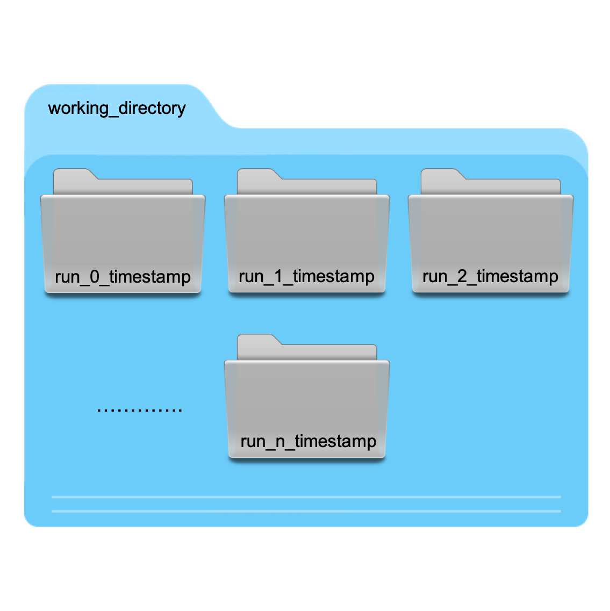

.. _runmodel_doc:

RunModel
==========

.. automodule:: UQpy.RunModel

Architecture & Workflow
-----------------------

The ``RunModel`` class has four basic workflows delineated in two levels. At the first level, ``RunModel`` can be used for execution of either a Python computational model, in which case the model is imported and run directly, or for execution of a third-party software model. When running with a third-party software model, ``RunModel`` interfaces with the model through text-based input files and serves as the "driver" to initiate the necessary calculations. At the second level, the jobs that are run by ``RunModel`` can either be executed
in series or in parallel. Within the third-party model parallel execution workflow, there are two cases, which are triggered by the ``cluster`` variable. In the following sections the workflow is discussed in detail.

.. image:: _static/Runmodel_workflow.png
   :width: 600

Python Model Workflow: Serial Execution
^^^^^^^^^^^^^^^^^^^^^^^^^^^^^^^^^^^^^^^

A common workflow in ``UQpy`` is when the computational model being evaluated is written in Python. This workflow is invoked by calling ``RunModel`` without specifying an ``input_template`` (i.e. ``input_template = None``) and setting ``model_script`` to the user-defined Python script containing the model. This python model is run serially by setting ``ntasks = 1``.

``UQpy`` imports the ``model_script`` and executes the object defined by ``model_object_name``. The ``model_object`` can be structured such that it accepts one sample at a time or accepts an array/list of samples all at once. The ``model_object`` may be a class or a function. If the ``model_object`` is a class, the quantity of interest must be stored as an attribute of the class called ``qoi``. If the model object is a function, it must return the quantity of interest after execution.

Details for ``model_script`` can be found in the Section entitled :ref:`Files & Scripts Used by RunModel`.

Python Model Workflow: Parallel Execution
^^^^^^^^^^^^^^^^^^^^^^^^^^^^^^^^^^^^^^^^^

The python model is executed in parallel by setting ``ntasks`` equal to the desired number of tasks (greater than 1) to be executed concurrently. In this
case, the ``model_script`` and corresponding ``model_object`` should be defined to accept a single sample. ``RunModel`` uses the ``multiprocessing`` library for
parallel execution of python models, which restricts parallelization to the cores available within a single computer. A workaround to this, to run in parallel across multiple compute nodes, is to treat the python model as a third-party model and run with the third-party parallel execution workflow discussed below.

Details for ``model_script`` can be found in the Section entitled :ref:`Files & Scripts Used by RunModel`.

Third-Party Model Workflow: Serial Execution
^^^^^^^^^^^^^^^^^^^^^^^^^^^^^^^^^^^^^^^^^^^^^^

The ``RunModel`` class also supports running models using third-party software. This worrkflow uses a text-based template input file, ``input_template``, to pass
information from ``UQpy`` to the third-party model, and a Python script ``output_script`` to process the outputs and collect the results for post-processing.

This workflow operates in three steps as explained in the following:

1. ``UQpy`` takes the file ``input_template`` and generates an indexed set of input files, one for each set of sample values passed through the ``samples`` input. For
   example, if the name of the template input file is ``input.inp``, then ``UQpy`` generates indexed input files by appending the sample number between the filename       and extension, as ``input_1.inp``, ``input_2.inp``, ... , ``input_n.inp``, where ``n`` is the number of sample sets in ``samples``. The details of how the
   ``input_template`` should be structured are discussed in the Section entitled :ref:`Files & Scripts Used by RunModel`. During serial execution, one input file is
   generated, the model is executed, another input file is generated, the model is executed, and so on.

2. The third-party software model is executed for each set of sample values using the indexed model input file generated in Step 1 by calling the Python
   script specified in ``model_script`` and passing the sample index.  This can be done either serially (which may be performed by setting ``ntasks = 1``) or in
   parallel over multiple processors (by setting ``ntask > 1``).

3. For each simulation, the third-party model generates some set of outputs in Step 2. The user-defined ``output_script`` is used to post-process these outputs
   and return them to ``RunModel`` in a list form, defined as an attribute of ``RunModel`` called ``qoi_list``. This script should extract any desired quantity of
   interest from the generated output files, again using the sample index to link model outputs to their respective sample sets. ``UQpy`` imports the ``output_script``
   and executes the object defined by ``output_object_name``. The structure of the ``output_object`` must be such that it accepts, as input, the sample index. If the
   ``output_object`` is a Class, the quantity of interest must be stored as an attribute of the class called ``qoi``. If the ``output_object`` it is a function, it
   must return the quantity of interest after execution. More details specifying the structure of ``output_script`` and the associated ``output_object`` can be found
   in the Section entitled :ref:`Files & Scripts Used by RunModel`. Finally, because ``UQpy`` imports the ``output_script`` and executes it within ``RunModel``, the
   values returned by the output object are directly stored according to their sample index in the ``RunModel`` attribute ``qoi_list``.

Third-Party Model Workflow: Parallel Execution
^^^^^^^^^^^^^^^^^^^^^^^^^^^^^^^^^^^^^^^^^^^^^^

Parallel execution in ``RunModel`` is carried out by the `GNU parallel` library [1]_. GNU parallel is essential and must be installed on the computer running the model. Information regarding how to install GNU parallel is provided at `https://www.gnu.org/software/parallel <https://www.gnu.org/software/parallel>`_. Parallel execution is activated in ``RunModel`` by setting the parameter ``ntasks>1``. The key differences in terms of the workflow are listed below.

1. During parallel execution, all required input files are generated prior to model execution as opposed to serial execution where input files are generated
   individually prior to each run.

2. `GNU parallel` divides the total number of jobs into a number of chunks specified by the variable ``ntasks``. ``ntasks`` number of jobs are executed in parallel and
   this continues until all the jobs finish executing. Note that the jobs can be executed across multiple compute nodes when ``cluster = True`` using the SLURM 
   workload manager. This is specified by setting ``cores_per_task`` and ``nodes`` appropriately. Details can be found in the description of the :ref:`RunModel Class`. 
   Whether in serial or parallel, the sample index is used by ``RunModel`` to keep track of model execution and to link the samples to their corresponding outputs.
   ``RunModel`` achieves this by consistently naming all the input files using the sample index (see Step 1) and passing the sample index into ``model_script``. More
   details on the precise structure of ``model_script`` are discussed in the Section entitled :ref:`Files & Scripts Used by RunModel`.

3. Output processing in the parallel case is performed after all the runs are completed, whereas in the serial case it is done after every individual run.

Directory Structure During Third-Party Model Evaluation
^^^^^^^^^^^^^^^^^^^^^^^^^^^^^^^^^^^^^^^^^^^^^^^^^^^^^^^^

To execute ``RunModel``, the working directory must contain the necessary files (i.e. ``model_script``, ``input_template``, and ``output_script``) along with any other files required for model evaluation. These may include, among other things, compiled executable files for third-party software that runs locally.  There is an option to specify a model directory (``model_dir``) as an input to ``RunModel``, which creates a new directory whose name is given by appending a timestamp corresponding to the time of executing the model to ``model_dir``. All files in the working directory are copied to the newly created model directory as illustrated below, and this directory becomes the working directory for executing the model. The default model directory is ``model_dir='Model_Runs'``.

.. image:: _static/Runmodel_directory_1.png
   :width: 300

To avoid cluttering the working directory with outputs, ``RunModel`` creates a directory for each execution of the model and saves the output generated during the  model execution within the corresponding directory. ``RunModel`` generates the directory name for the sample as `run_n_timestamp`, where `n` is the python index of the run and `timestamp` corresponds to the time at the beginning of the first simulation of the parallel job. This is illustrated in the figure below.

   
Within the working directory for each run, ``RunModel`` creates a new directory `InputFiles` and deposits the input files generated in Step 1 above into this directory. The user's ``model_script`` must retrieve the relevant input file during the model execution. During model execution, ``RunModel`` first copies all the files in the working directory to the directory for each sample, executes the model, and then deletes all the files copied into this directory from the working directory. Any output generated either during model execution or during output processing remains in this directory, as does the `InputFiles` directory. This is illustrated in the figure below.

.. image:: _static/Runmodel_directory_3.png
   :width: 300

Files & Scripts Used by RunModel
^^^^^^^^^^^^^^^^^^^^^^^^^^^^^^^^^^^^^^^^^^^^^^

As discussed in the sections above and illustrated in the examples, the ``RunModel`` class utilizes a python script to execute the computational model (``model_script``), a python script to extract the output (``output_script``) and a template input file (``input_template``). This section is intended to provide a closer look at each of these files, their structure, and when/if they are required.

**model_script**

``model_script`` is the user-defined Python script that runs the computational model. It can be employed in two different ways depending on the type of model being executed.

* *Python Model:* For a python model, the ``model_script`` is directly imported into the working python environment. The ``model_script`` must have an object (either a class object or a function object) defined within it, and specified in ``RunModel`` by ``model_object_name``, that contains the computational model itself. The ``samples`` passed to ``RunModel`` and any additional keyword arguments are passed as inputs to the model object. Examples for how the Python model may be structured are provided below.

**Example:** Model object as a class:

.. code-block:: python

   class ModelClass:
	 def __init__(self,  input=one_sample, **kwargs):
	 	# Execute the model using the input and get the output
	 	self.qoi = output

**Example:** Model object as a function:

.. code-block:: python

   def model_function(input=one_sample, **kwargs):
	 # Execute the model using the input and get the output
	 return output
	 
* *Third-Party Software Model:* When running a third-party model, ``RunModel`` does not import ``model_script``. Instead, ``RunModel`` calls the model script through
  the command line as
    
    ``$ python3 model_script(sample_index)``
    
  using the Python ``fire`` module. Notice the only variable passed into ``model_script`` is the ``sample_index``. This is because the samples are being passed through the input files (via ``input_template``, see below). For example, if the model object is passed the sample index `n`, it should then execute the model using the input file whose name is `input_n.inp`, where ``input_template = 'input.inp'``.
  
  In the ``model_script`` file, it is necessary to build the executable commands into a function so that the sample index can be passed into the script -- allowing the script to recognize which input file to use. Because the executable commands must be built into a function, it is necessary to call this function using the Python ``fire`` module as illustrated in the first two lines of ``matlab_model_script.py`` below.
  
  Also note that the ``model_script`` must index the name of the output file for subsequent postprocessing through the ``output_script`` discussed below.
    
  An example of the the ``model_script`` corresponding to execution of a Matlab model with ``input_template = 'matlab_model.m'``, as illustrated in the ``input_template`` example, is given below.
  
``matlab_model_script.py``  

.. code-block:: python
	
   import os
   import fire
   
   if __name__ == '__main__':
      fire.Fire(model)

   def model(sample_index):
      # Copy the input file into the cwd
      command1 = "cp ./InputFiles/matlab_model_" + str(index+1) + 
	             ".m ."
      command2 = "matlab -nosplash -nojvm -nodisplay -nodesktop -r 
	             'run matlab_model_" + str(sample_index + 1) + ".m; 
				 exit'"
      # Rename the output file
      command3 = "mv y.txt y_" + str(sample_index+1) + ".txt"
	  
      os.system(command1)
      os.system(command2)
      os.system(command3)

Examples of the ``model_script`` are given in the `example` folder on the ``UQpy`` repository as described in the Section entitled :ref:`Examples & Template Files`.

**input_template**

``input_template`` is a user-defined file that is is used only when executing a third-party software model with ``RunModel``. As the name implies, ``input_template`` serves as a template of the model input file from which individual, run-specific model input files will be generated for each model evaluation. The model input file is typically an ASCII text-based file that defines all parameters (e.g. geometry, material properties, boundary conditions, loading, etc.) of the computational model. For each individual model evaluation, ``RunModel`` will modify this template through place-holder variables following a ``UQpy`` specific convention. This convention is described herein. The place-holder variables are replaced with numerical values from the ``samples`` passed as input to ``RunModel``.

``UQpy`` place-holder variable convention:

*  Place-holders are defined by using ``< >`` around the variable name within the template input file.

   Variable names are specified within ``RunModel`` using the ``var_names`` input. ``RunModel`` scans the text within the input template looking for place-holders with each variable name and places the corresponding sample values in that location in the model input file.
   
   If ``var_names = None``, ``RunModel`` assigns default variable names as `x0`, `x1`, `x2`, ..., `xn`.
   
*  Standard python indexing is supported when using place-holders. 

   For example, if `var1` is a numpy array, then it is possible to specify ``<var1[i][j]>``, which will then place the corresponding `i,j` component of `var1` at that location. If `var1` is an array and no index is specified within the place-holder then the entire contents of `var1` are written in a delimited format at that location in the input file, where the user can prescribe the delimiter using the ``separator`` input.
   
*  In order to properly build the input files for each model evaluation, it is critical that the ``samples`` passed into ``RunModel`` adhere to the following simple rules:

   1. The first dimension of ``samples`` must correspond to the number of samples at which the model will be evaluated.
   
   2. The second dimension of ``samples`` must correspond to the number of variables being passed into each model evaluation. Note that variables do not need to be scalars. Variables can be scalars, vectors, matrices, or tensors. When writing vectors, matrices, and tensors, they are first flattened and written in delimited form.

Examples of the ``template_input`` are given in the `example` folder on the ``UQpy`` repository as described in the Section entitled :ref:`Examples & Template Files`.  

**output_script**

The ``output_script`` is an optional user-defined Python script for post-processing model output. Specifically, it is used to extract user-specified quantities of interest from third-party model output files and return them to ``RunModel``. ``UQpy`` imports the ``output_script`` and executes the object defined by ``output_object_name``. The output object should accept only the sample index as input. If the model object is a Class, the quantity of interest must be stored as an attribute of the class called ``qoi``. If it is a function, it must return the quantity of interest after execution. Examples for how the output object may be structured are provided below.

**Example:** Output object as a class:

.. code-block:: python

   class OutputClass:
	 def __init__(self,  input=sample_index):
	 	# Postprocess the output files corresponding to the 
		# sample number and extract the quantity of interest
	 	self.qoi = output

**Example:** Output object as a function:

.. code-block:: python

   def output_function(input=sample_index):
	 # Postprocess the output files corresponding to the sample 
	 # number and extract the quantity of interest
	 return output

**Executable Software**

Often, the working directory will contain an executable software program. This is often the case for custom software and for software that does not lie in the user's path.
  
Examples & Template Files
--------------------------

In the `example` folder, several examples are provided to run both python models and third-party software models in serial and in parallel. These examples are briefly summarized below. Note that the problems presented are for demonstration purposes and are not necessarily intended to be used for accurate modeling of the problems described. Instead, the primary intention is to show the files that are used in running models with each software package - in particular the ``model_script`` and ``input_template``.

**Python Models**

Several simple mathematical python models are provided in a Jupyter script entitled `Python_Model_with_Heterogeneous_Data.ipynb`. These examples illustrate how to write functions and classes that execute models in python using ``RunModel``.  The notebook executes models in serial and in parallel. The models themselves are provided in the python file `python_model.py`.

**Third-Party Models**

``RunModel`` can be used to execute nearly any third-party model. In the `example` folder, we provide files for the execution of several commonly-used engineering software packages.

*Abaqus Model*

Code is provided for execution of 100 Monte Carlo samples of two random variables for the analysis of a beam subject to thermo-mechanical loading under fire conditions. The example is described in [2]_. The analysis is set up to run on a HPC cluster (specifically the Maryland Advanced Research Computing Center, MARCC) using the SLURM scheduler from the shell script `run_sfe_example.sh`. The model executes 100 finite element calculations using the Abacus software over a total of 25 cores on a single compute node with each calculation using 1 core. The requisite ``RunModel`` files are the following:

* ``model_script = 'abaqus_fire_analysis.py'``
* ``input_template = 'abaqus_input.py'``
* ``output_script = 'extract_abaqus_output.py'``

Also necessary is the Abaqus postprocessing script `abaqus_output_script.py`.

Of particular note is the ``input_template``. For Abaqus, the ``input_template`` may be an Abaqus input (`.inp`) file or an Abaqus python model file (`.py`). In this case, we directly input the variables in the Python model generation file.

*LS-DYNA Model*

Code is provided for execution of arbitrary Lagrangian-Eulerian finite element calculations of a small material element with random spherical voids. Two examples are provided, entitled `single_job` and `multi-job`.

The `single_job` calculation executes a single finite element calculation on an HPC cluster (specifically MARCC) using the SLURM scheduler over 2 nodes and using a total of 48 cores. The requisite ``RunModel`` files are the following:

* ``model_script = 'dyna_script'``
* ``input_template = 'dyna_input.k'``

No ``output_script`` is used for postprocessing. 

The `multi_job` calculation executes 12 finite element calculations on an HPC cluster (specifically MARCC) using the SLURM scheduler over 3 nodes with each calculation using 12 cores. The requisite ``RunModel`` files are the following:

* ``model_script = 'dyna_script'``
* ``input_template = 'dyna_input.k'``

No ``output_script`` is used for postprocessing. 

Note that in both models, LS-DYNA requires that the text-based input cards each possess 10 characters. Therefore, it is necessary to set ``fmt='{:>10.4f}' in ``RunModel`` to write the variables to the input files correctly.

Note that these calculations are for demonstration purposes only and are not intended to be physically representative of any material system. Moreover, to make them computationally inexpensive the mesh is severely under-resolved.

*Matlab Model*

Several simple mathematical Matlab models are provided in a Jupyter script entitled `Third-Party_Model_with_Heterogeneous_Data.ipynb`. These examples illustrate how to write variables to a matlab model (`.m`) file using ``RunModel``. Several ``template_input`` and ``model_script`` files are provided.  The notebook executes models in serial and in parallel. 

These examples do not use HPC resources.

*OpenSees Model*

The model considers a six-story building with 2 bays in the X-direction and 2 bays in the y-directions. The model has reinforced-concrete rectangular columns and beams. A static pushover analysis is performed. At each story the concrete’s yield strength fc ~Uniform (15000, 25000), the reinforcement steel’s Young’s modulus Es ~Uniform (2.0e8, 0.5e8) and yield strength Fy ~Uniform (450000, 530000) are considered random variables. Thus, the problem has a total of 6*3 = 18 random variables. The horizontal displacement (x-axis) of the top floor is monitored.

Five Monte Carlo samples are generated and the model is evaluated in parallel over five CPUs on an HPC cluster (specifically MARCC) using the SLURM scheduler. The requisite ``RunModel`` files are the following:

* ``model_script = opensees_model.py``
* ``input_template = import_variables.tcl``
* ``output_script = process_opensees_output.py``

The other necessary files are the following:

* `columndimensions.tcl`
* `RCsection.tcl`
* `run_opensees_UQpy.py`
* `run_OpenSees.sh`
* `test.tcl`

Note that this example is not intended to represent the accurate pushover analysis a real structure. It is for ``UQpy`` illustration purposes only.

RunModel Class
--------------

.. autoclass:: UQpy.RunModel.RunModel
	:members:

.. [1] Tange, Ole. (2018). GNU Parallel 2018, `https://doi.org/10.5281/zenodo.1146014 <https://doi.org/10.5281/zenodo.1146014>`_

.. [2] Olivier, A., Aakash, B.S., Chauhan, M., Vandanapu, L., Giovanis, D.G., and Shields, M.D. (In Review) "UQpy: A general purpose Python package and development environment for uncertainty quantification." `Journal of Computational Science`.
