UQpy architecture
==================

Distributions
-----------------------

The UML diagram below explains the class hierarchy of the distributions module. In case of distributions a series of
abstract base classes are defined. :class:`.Distribution` is the basis, with classes such as :class:`.Distribution1D` \
and :class:`.DistributionND` abstract base classes refining this hierarchy according to the distribution dimensionality.
The 1D case if further refined with :class:`.DistributionContinuous1D` and :class:`.DistributionDiscrete1D` to take into
account different types of random variables. Finally, the :class:`.Copula` abstract base class serves as the common
interface for all copula implementations. Note that all the above are abstract classes and cannot be directly
instantiated.

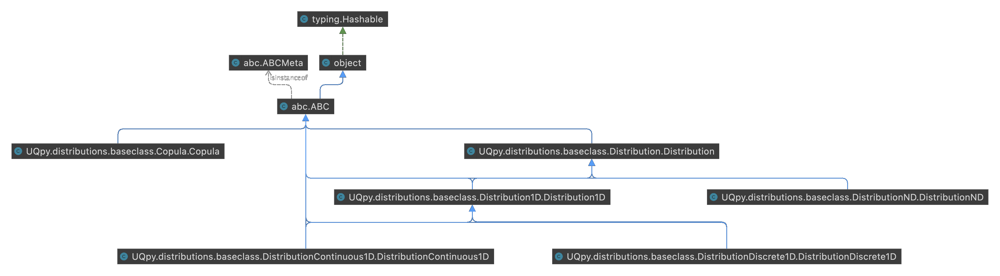

Sampling
-----------------------

The sampling module contains multiple methods and the UML diagrams below are focused to one method at a time to reduce
the complexity of the graphs. Before starting with hierarchy of each different method, we should mention that the
classes :class:`.MonteCarloSampling`, :class:`.SimplexSampling` and :class:`.ImportanceSampling` are independent object
and do not extend any baseclass.

Starting with the Markov Chain Monte Carlo algorithms, the diagram below makes obvious the dependency between the
different implementations. the :class:`.MCMC` abstract base class includes the common functionality between the methods,
while the specific algorithms only override the abstract methods of that base class.

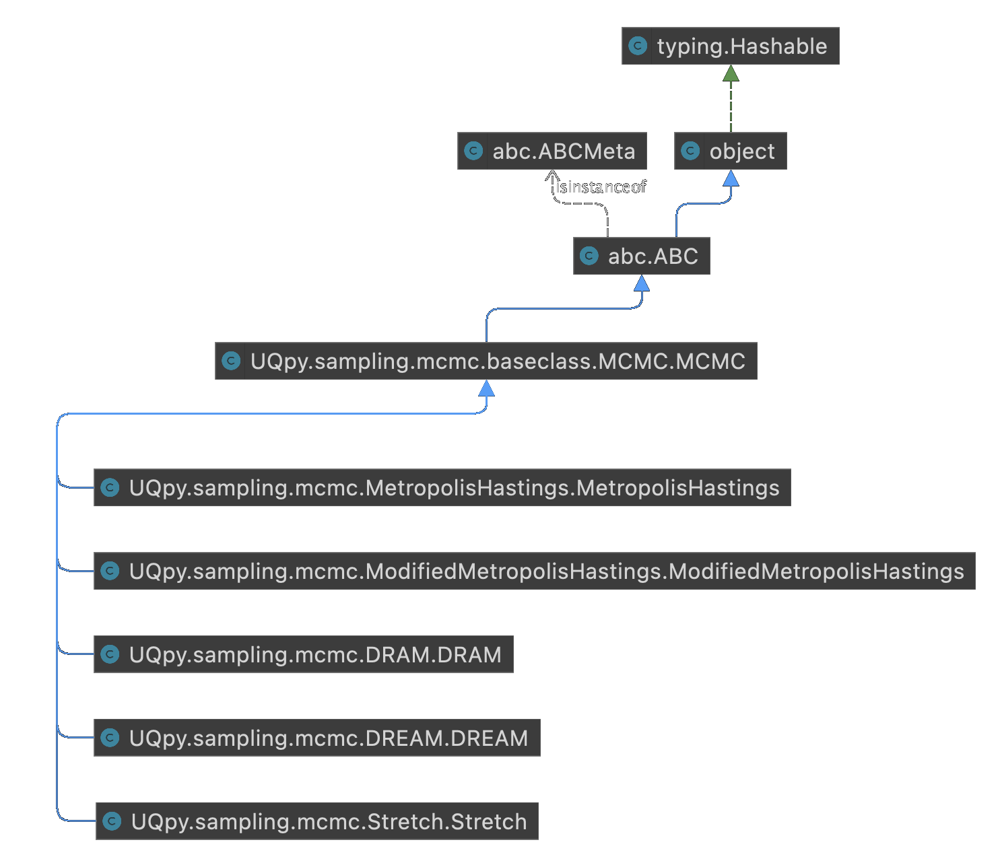

The case of stratified sampling is more elaborate, as it includes a family of algorithms. The abstract base class
:class:`.StratifiedSampling` serves as the interface between the concrete implementations :class:`.LatinHypercubeSampling`,
:class:`.TrueStratifiedSampling` and :class:`.RefinedStratifiedSampling`. In the case of :class:`.LatinHypercubeSampling`
the Strategy Design Pattern was used to extract the Latin Hypercube criteria from the sampling. Here the
:class:`.Criterion` base class provides the interface that the specific criteria need to override. In a similar manner,
the geometric stratification in the case of :class:`.TrueStratifiedSampling` is extracted under the
:class:`.Strata` abstract base class. Last but not least, in the case of :class:`.RefinedStratifiedSampling`
the different strata refinement strategies are extracted using the :class:`.Refinement` baseclass as their common interface.

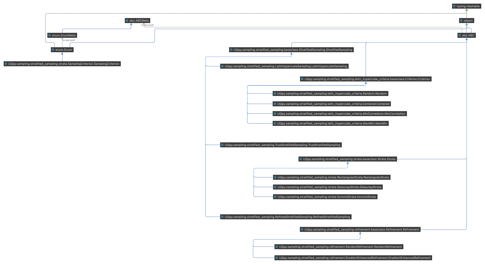

In the case of :class:`.AdaptiveKriging` sampling methods, again the different learning functions are extracted into
separate classes under the common :class:`.LearningFunction` class.

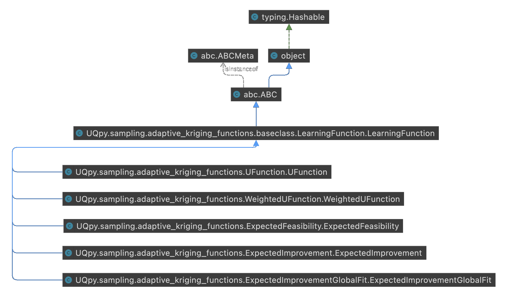

Transformations
-----------------------

The transformations module is one of the most simple in :py:mod:`UQpy` with three independent classes available, namely
:class:`.Nataf`, :class:`.Correlate` and :class:`.Decorrelate`.

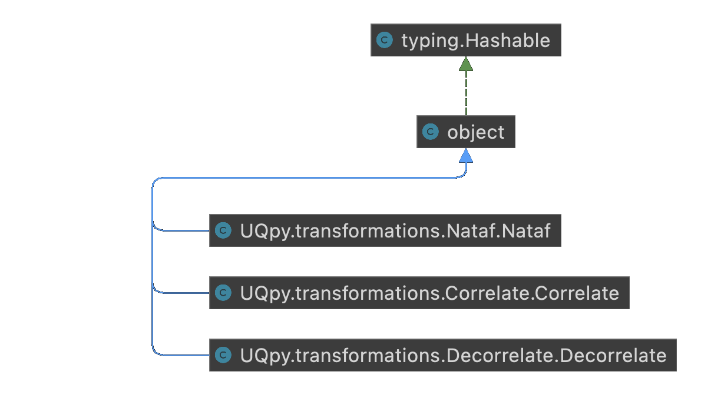

Stochastic Processes
-----------------------

The stochastic process module is has again simple structure with five independent classes available.

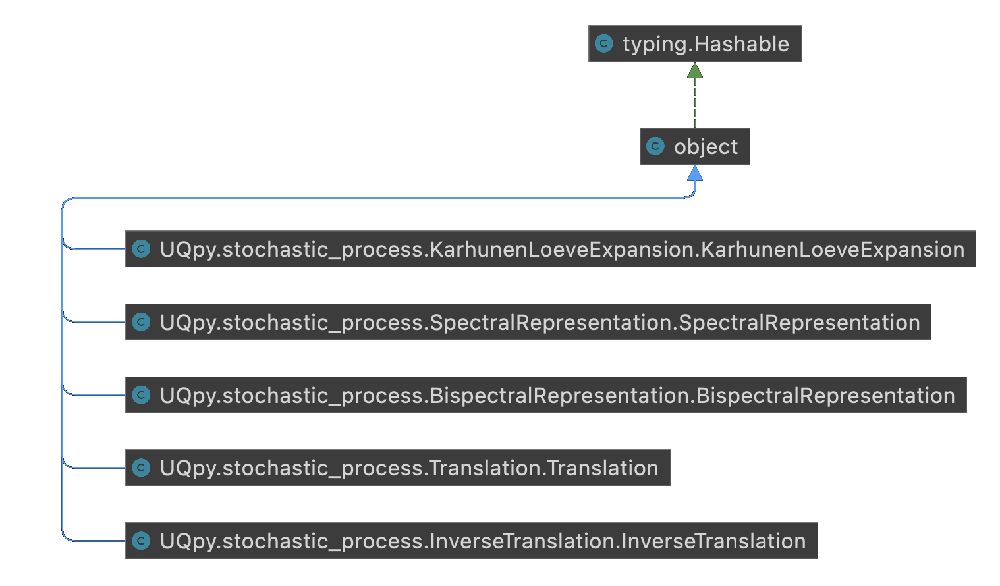

Run Model
-----------------------

In case of the RunModel module, the final algorithm to run is constructed by object composition of two different inputs.
Initially, the type of the model to run, with :class:`.PythonModel` and :class:`.ThirdPartyModel` being the two
available options, while the execution part is delegated to either the :class:`.SerialExecution` or :class:`.ParallelExecution`
alternatives.

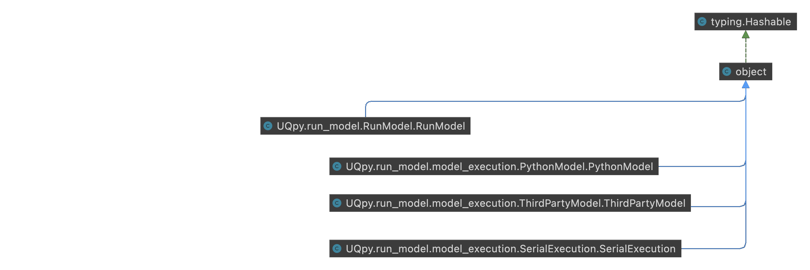

Inference
-----------------------

Compared to v3, the inference module has undergone a major refactoring towards v4. The initial :class:`.InferenceModel`
class that contained all cases of computing the posterior log-likelihood is now split into three independent cases. Given
the inference models, backward uncertainty propagation can be performed be choosing between :class:`.MLE`,
:class:`.BayesParameterEstimation` to infer the parameter distributions of a model, or :class:`.InformationModelSelection`
and :class:`.BayesModelSelection` to select the model that best describes the available data. In the case of
:class:`.InformationModelSelection` the selection criteria have been extracted into separate classes under the
:class:`.InformationCriterion` baseclass. Similarly, the evidence methods of :class:`.BayesModelSelection` are also
parameters  that implement the abstract base class :class:`.EvidenceMethod`.

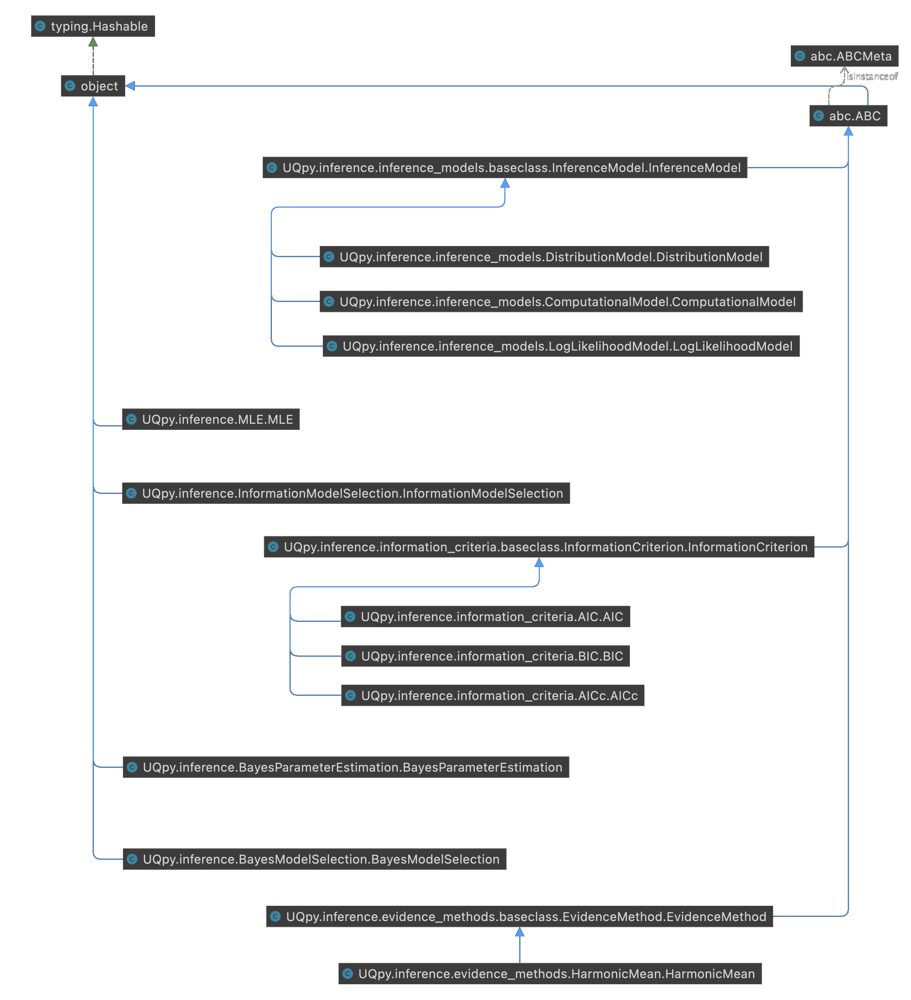

Reliability
-----------------------

The reliability module maintained the same class hierarachy as in v3, with :class:`.SubsetSimulation` being an
independent class and :class:`.FORM` and :class:`.SORM` methods providing concrete implementations to the
:class:`.TaylorSeries` abstract base class.

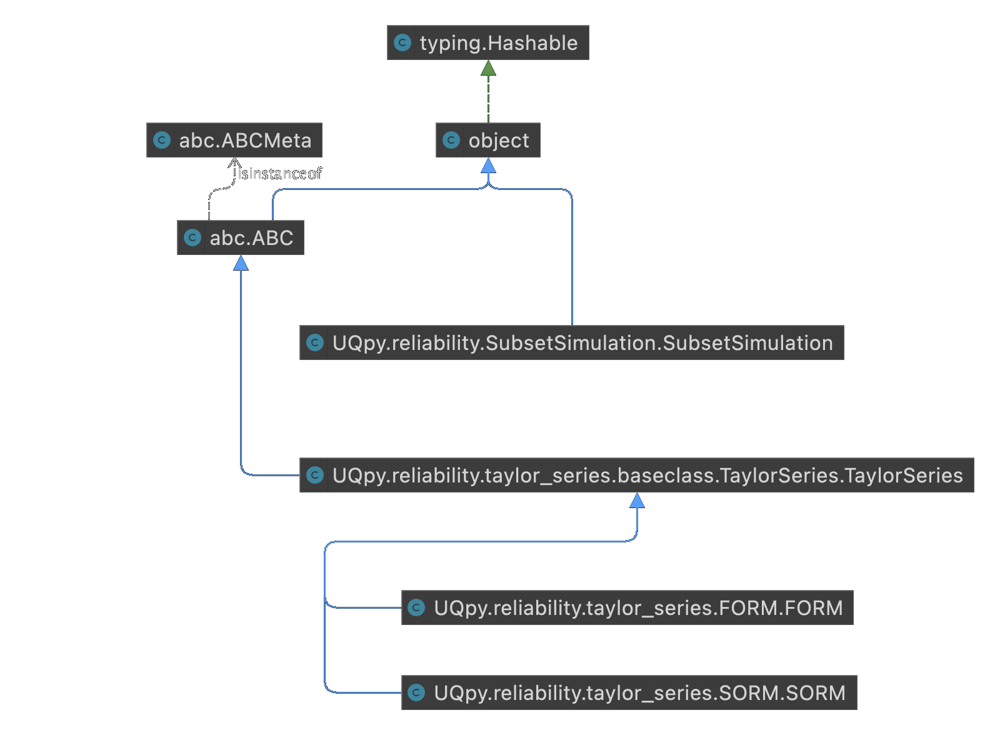

Surrogates
-----------------------

Another module that has extensively restructured in v4 is the surrogates. Apart from the :class:`.SROM` method which
was retained as an independent algorithm, the previous Kriging functionality was removed. It is now replaced with
:class:`.GaussianProcessRegression`. The functionality of the Gaussian is constructed using object composition,
and the specific implementation of :class:`.Regression` and :class:`Kernel` abstract base classes. An additional
functionality of constrained surrogates is added by implementing the :class:`.ConstraintsGPR` abstract class. The
functionality of :class:`.PolynomialChaosExpansion` was rewritten from scratch to address some performance issues of v3.
The Strategy Design pattern was used here as well, with three abstract base classes :class:`.Polynomials`,
:class:`.PolynomialBasis` ans :class:`.Regression` serving as the interface for the concrete classes.

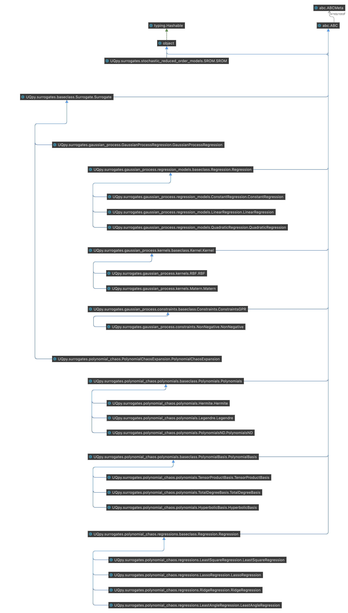

Sensitivity
-----------------------

The sensitivity module has significantly benefited from the enhanced of modularity of the code introduced in v4.
Apart from the existing independent :class:`.MorrisSensitivity` method, the :class:`.PceSensitivity` was added as an
independent class. Finally, based on the common :class:`.Sensitivity` abstract base class, a series of new algorithms
were introduced such as :class:`.SobolSensitivity`, :class:`.GeneralizedSobolSensitivity`, :class:`.ChatterjeeSensitivity`
and :class:`.CramerVonMisesSensitivity`.

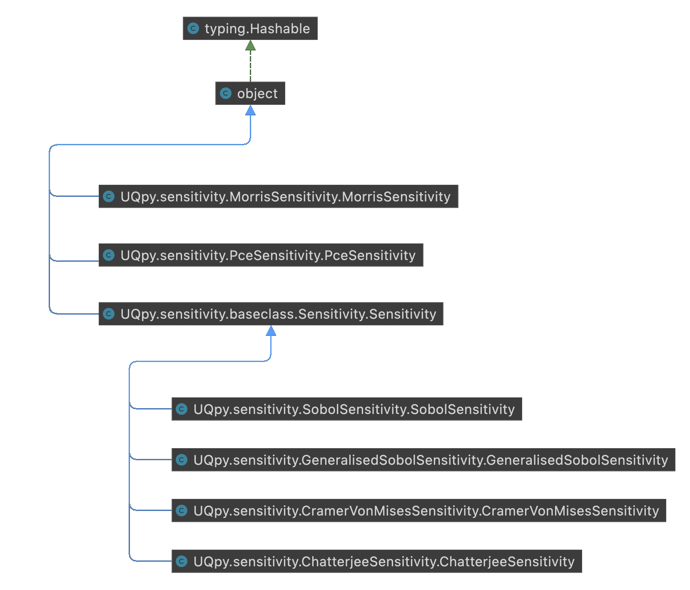

Dimension Reduction
-----------------------

The final but one of the most import modules in :py:mod:`UQpy` is dimension reduction. The :class:`.SnapshotPOD` and
:class:`.DirectPOD` methods were retained under the :class:`.POD` abstract base class. :class:`.HigherOrderSVD` method
was introduced as independent class, while special attention was given to Grassmann Manifolds.
The abstract base class :class:`.GrassmannProjection` serves as an interface for different methods to project data on
the Grassmann Manifold, with :class:`.GrassmannOperations` and :class:`.GrassmannInterpolation` support all related operations.

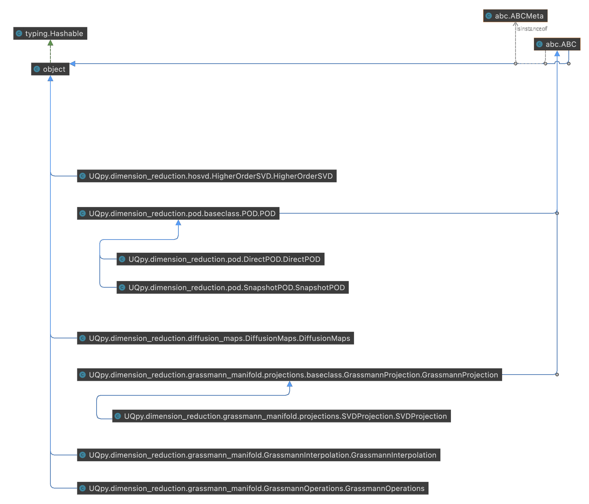
