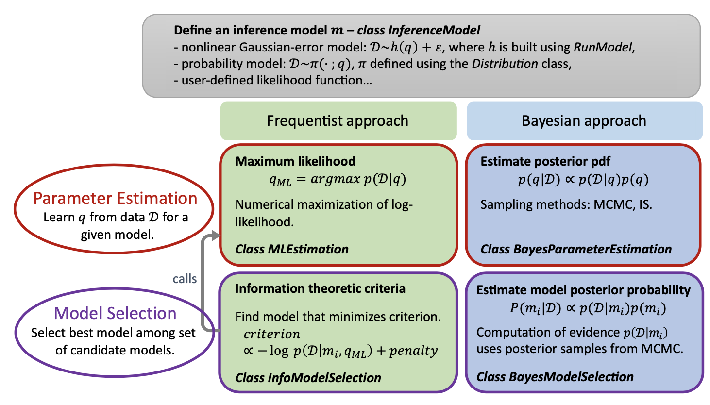

Inference
=============

This module contains classes and functions for statistical inference from data.

The module currently contains the
following classes:

* :class:`.InferenceModel`: Define a probabilistic model for inference.
* :class:`.InformationModelSelection`: Perform model selection using information theoretic criteria.
* :class:`.BayesModelSelection`: Estimate model posterior probabilities.
* :class:`.BayesParameterEstimation`: Perform Bayesian parameter estimation (estimate posterior density) via :class:`.MCMC` or :class:`.ImportanceSampling`.
* :class:`.MLE`: Compute maximum likelihood parameter estimate.

The goal in inference can be twofold: 1) given a model, parameterized by parameter vector :math:`\theta`, and some
data :math:`\mathcal{D}`, learn the value of the parameter vector that best explains the data; 2) given a set of
candidate models :math:`\lbrace m_{i} \rbrace_{i=1:M}` and some data :math:`\mathcal{D}`, learn which model best
explains the data. :py:mod:`UQpy` currently supports the following inference algorithms for parameter estimation
(see e.g. :cite:`MCMC2` for theory on parameter estimation in frequentist vs. Bayesian frameworks):

* Maximum Likelihood estimation,
* Bayesian approach: estimation of posterior pdf via sampling methods (:class:`.MCMC`/:class:`.ImportanceSampling`).

and the following algorithms for model selection:

* Model selection using information theoretic criteria,
* Bayesian model class selection, i.e., estimation of model posterior probabilities.

The capabilities of :py:mod:`UQpy` and associated classes are summarized in the following figure.

.. toctree::
   :maxdepth: 1
   :hidden:
   :caption: Inference

    Inference Models <inference_models>
    Maximum Likelihood Estimation <mle>
    Bayes Parameter Estimation <bayes_parameter_estimation>
    Information Theoretic Model Selection <info_model_selection>
    Bayes Model Selection <bayes_model_selection>

