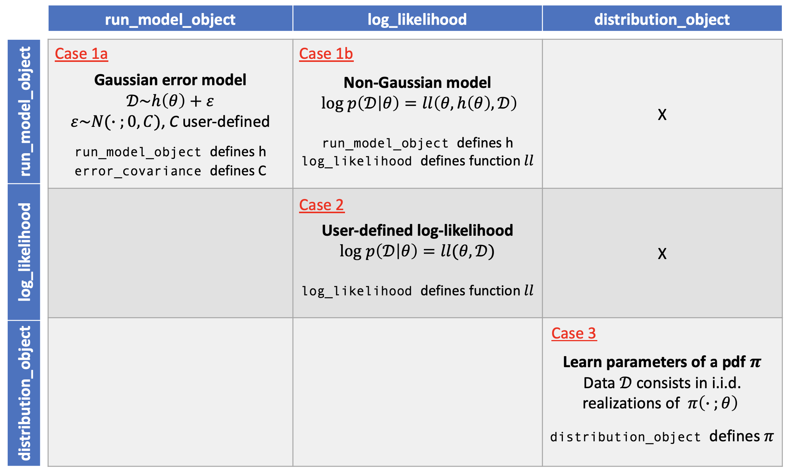

InferenceModel
--------------------------------

For any inference task, the user must first create, for each model studied, an instance of the class :class:`.InferenceModel`
that defines the problem at hand. This class defines an inference model that will serve as input for all remaining
inference classes. A model can be defined in various ways. The following summarizes the four types of inference models
that are supported by :py:mod:`UQpy`. These four types are further summarized in the figure below.

* **Case 1a** - `Gaussian error model powered by` :class:`.RunModel`: In this case, the data is assumed to come form a
  model of the following form,  `data ~ h(theta) + eps`, where `eps` is iid Gaussian and `h` consists of a computational
  model executed using :class:`.RunModel`. Data is a 1D ndarray in this setting. In order to define such a inference model,
  the :class:`.ComputationalModel` class must be utilized.

* **Case 1b** - `non-Gaussian error model powered by` :class:`.RunModel`: In this case, the user must provide the likelihood
  function in addition to a :class:`.RunModel` object. The data type is user-defined and must be consistent with the
  likelihood function definition. In order to define such a inference model, the :class:`.ComputationalModel` class must be utilized.

* **Case 2:** - `User-defined likelihood without` :class:`.RunModel`: Here, the likelihood function is user-defined and
  does not leverage :class:`.RunModel`. The data type must be consistent with the likelihood function definition.
  In order to define such a inference model, the :class:`.LogLikelihoodModel` class must be utilized.

* **Case 3:** `Learn parameters of a probability distribution:` Here, the user must define an object of the
  :class:`.Distribution` class. Data is an ndarray of shape `(ndata, dim)` and consists in `ndata` iid samples from the
  probability distribution. In order to define such a inference model, the :class:`.DistributionModel` class must be utilized.

Defining a Log-likelihood function
^^^^^^^^^^^^^^^^^^^^^^^^^^^^^^^^^^^^^
The critical component of the :class:`.InferenceModel` class, child classes is the evaluation of the log-likelihood function.
:class:`.InferenceModel` has been constructed to be flexible in how the user specifies the log-likelihood function.
The log-likelihood function can be specified as a user-defined callable method that is passed directly into the
:class:`.LogLikelihoodModel` class. As the cases suggest, a user-defined log-likelihood function must take as input, at
minimum, both the parameters of the model and the data points at which to evaluate the log-likelihood. It may also
take additional keyword arguments. The method may compute the log-likelihood at the data points on its own, or it may
rely on a computational model defined through the :class:`.RunModel` class. If the log-likelihood function relies on a
:class:`.RunModel` object, this object is also passed into :class:`.InferenceModel` and the log-likelihood method should also take
as input, the output (`qoi_list`) of the :class:`.RunModel` object evaluated at the specified parameter values.

InferenceModel Class Descriptions
^^^^^^^^^^^^^^^^^^^^^^^^^^^^^^^^^^^^^^^^

.. autoclass:: UQpy.inference.inference_models.baseclass.InferenceModel
   :members:

ComputationalModel Class Descriptions
^^^^^^^^^^^^^^^^^^^^^^^^^^^^^^^^^^^^^^^^

.. autoclass:: UQpy.inference.inference_models.ComputationalModel

DistributionModel Class Descriptions
^^^^^^^^^^^^^^^^^^^^^^^^^^^^^^^^^^^^^^^^

.. autoclass:: UQpy.inference.inference_models.DistributionModel

LogLikelihoodModel Class Descriptions
^^^^^^^^^^^^^^^^^^^^^^^^^^^^^^^^^^^^^^^^

.. autoclass:: UQpy.inference.inference_models.LogLikelihoodModel
