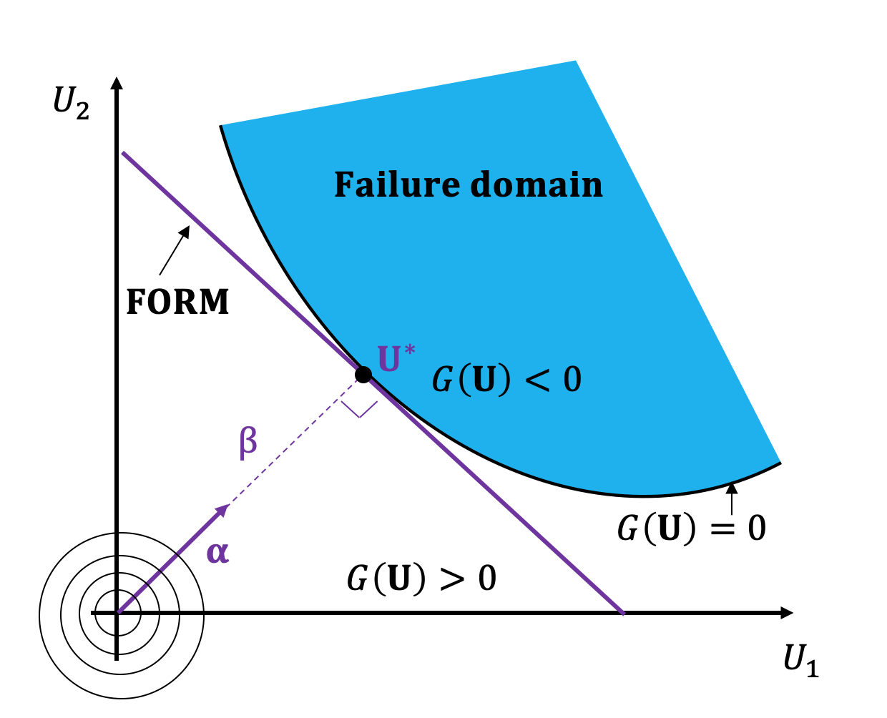

.. _reliability_doc:

Reliability
===========

Reliability of a system refers to the assessment of its probability of failure (i.e the system no longer satisfies some performance measures), given the model uncertainty in the structural, environmental and load parameters. Given a vector of random variables :math:`\textbf{X}=\{X_1, X_2, \ldots, X_n\} \in \mathcal{D}_\textbf{X}\subset \mathbb{R}^n`, where :math:`\mathcal{D}` is the domain of interest and :math:`f_{\textbf{X}}(\textbf{x})` is its joint probability density function then, the probability that the system will fail is defined as

.. math:: P_f =\mathbb{P}(g(\textbf{X}) \leq 0) = \int_{D_f} f_{\textbf{X}}(\textbf{x})d\textbf{x} = \int_{\{\textbf{X}:g(\textbf{X})\leq 0 \}} f_{\textbf{X}}(\textbf{x})d\textbf{x}

where :math:`g(\textbf{X})` is the so-called performance function. The reliability problem is often formulated in the standard normal space :math:`\textbf{U}\sim \mathcal{N}(\textbf{0}, \textbf{I}_n)`, which means that a nonlinear isoprobabilistic  transformation from the generally non-normal parameter space :math:`\textbf{X}\sim f_{\textbf{X}}(\cdot)` to the standard normal is required (see the ``Tansformations`` module). The performance function in the standard normal space is denoted :math:`G(\textbf{U})`. ``UQpy`` does not require this transformation and can support reliability analysis for problems with arbitrarily distributed parameters.

.. automodule:: UQpy.Reliability

Subset Simulation
-------------------

In the subset simulation method [3]_ the probability of failure :math:`P_f`  is approximated by a product of probabilities of more frequent events. That is, the failure event :math:`G = \{\textbf{x} \in \mathbb{R}^n:G(\textbf{x}) \leq 0\}`, is expressed as the of union of `M` nested intermediate events :math:`G_1,G_2,\cdots,G_M` such that :math:`G_1 \supset G_2 \supset \cdots \supset G_M`, and :math:`G = \cap_{i=1}^{M} G_i`. The intermediate failure events are defined as :math:`G_i=\{G(\textbf{x})\le b_i\}`, where :math:`b_1>b_2>\cdots>b_i=0` are positive thresholds selected such that each conditional probability :math:`P(G_i | G_{i-1}), ~i=2,3,\cdots,M-1` equals a target probability value :math:`p_0`. The probability of failure :math:`P_f` is estimated as: 

.. math:: P_f = P\left(\cap_{i=1}^M G_i\right) = P(G_1)\prod_{i=2}^M P(G_i | G_{i-1})

where the probability :math:`P(G_1)` is computed through Monte Carlo simulations. In order to estimate the conditional probabilities :math:`P(G_i|G_{i-1}),~j=2,3,\cdots,M` generation of Markov Chain Monte Carlo (MCMC) samples from the conditional pdf :math:`p_{\textbf{U}}(\textbf{u}|G_{i-1})` is required. In the context of subset simulation, the Markov chains are constructed through a two-step acceptance/rejection criterion. Starting from a Markov chain state :math:`\textbf{x}` and a proposal distribution :math:`q(\cdot|\textbf{x})`, a candidate sample :math:`\textbf{w}` is generated. In the first stage, the sample :math:`\textbf{w}` is accepted/rejected with probability

.. math:: \alpha=\min\bigg\{1, \frac{p(\textbf{w})q(\textbf{x}|\textbf{w})}{p(\textbf{x})q(\textbf{w}|\textbf{x})}\bigg\}

and in the second stage is accepted/rejected based on whether the sample belongs to the failure region :math:`G_j`. ``SubSetSimulation`` can be used with any of the available (or custom) ``MCMC`` classes in the ``SampleMethods`` module.

SubsetSimulation Class Descriptions
^^^^^^^^^^^^^^^^^^^^^^^^^^^^^^^^^^^^^^^^

.. autoclass:: UQpy.Reliability.SubsetSimulation
    :members: 

Taylor Series
-------------

``TaylorSeries`` is a class that calculates the reliability  of a model using the First Order Reliability Method (FORM) or the Second Order Reliability Method (SORM) based on the first-order and second-order Taylor series expansion approximation of the performance function, respectively ([1]_, [2]_).

In FORM, the performance function is linearized according to

.. math:: G(\textbf{U})  \approx  G(\textbf{U}^\star) + \nabla G(\textbf{U}^\star)(\textbf{U}-\textbf{U}^\star)^\intercal

where :math:`\textbf{U}^\star` is the expansion point, :math:`G(\textbf{U})` is the performance function evaluated in the standard normal space and :math:`\nabla G(\textbf{U}^\star)` is the gradient of :math:`G(\textbf{U})` evaluated at :math:`\textbf{U}^\star`. The probability failure can be calculated by 

.. math:: P_{f, \text{form}} = \Phi(-\beta_{HL})

where :math:`\Phi(\cdot)` is the standard normal cumulative distribution function and :math:`\beta_{HL}=||\textbf{U}^*||` is the norm of the design point known as the Hasofer-Lind reliability index calculated with the iterative Hasofer-Lind-Rackwitz-Fiessler (HLRF) algorithm.  The convergence criteria used for HLRF algorithm are: 

.. math:: e1: ||\textbf{U}^{k} - \textbf{U}^{k-1}||_2 \leq 10^{-3}
.. math:: e2: ||\beta_{HL}^{k} - \beta_{HL}^{k-1}||_2 \leq 10^{-3}
.. math:: e3: ||\nabla G(\textbf{U}^{k})- \nabla G(\textbf{U}^{k-1})||_2 \leq 10^{-3}

In SORM the performance function is approximated by a second-order Taylor series around the design point according to 

.. math:: G(\textbf{U}) = G(\textbf{U}^\star) +  \nabla G(\textbf{U}^\star)(\textbf{U}-\textbf{U}^\star)^\intercal + \frac{1}{2}(\textbf{U}-\textbf{U}^\star)\textbf{H}(\textbf{U}-\textbf{U}^\star)

where :math:`\textbf{H}` is the Hessian matrix of the second derivatives of :math:`G(\textbf{U})` evaluated at :math:`\textbf{U}^*`. After the design point :math:`\textbf{U}^*` is identified and the probability of failure :math:`P_{f, \text{form}}` is calculated with FORM a correction is made according to 

.. math:: P_{f, \text{sorm}} = \Phi(-\beta_{HL}) \prod_{i=1}^{n-1} (1+\beta_{HL}\kappa_i)^{-\frac{1}{2}}

where :math:`\kappa_i` is the `i-th`  curvature. 

The ``TaylorSeries`` class is the parent class of the ``FORM`` and ``SORM`` classes that perform the FORM and SORM, respectively. These classes can be imported in a python script using the following command:

>>> from UQpy.Reliability import FORM, SORM

TaylorSeries Class Descriptions
^^^^^^^^^^^^^^^^^^^^^^^^^^^^^^^^^^^^^^^^

.. autoclass:: UQpy.Reliability.TaylorSeries
    :members: 

FORM
~~~~~~~~~~

.. autoclass:: UQpy.Reliability.FORM
    :members: 
	
SORM
~~~~~~~~~~

.. autoclass:: UQpy.Reliability.SORM
    :members: 
	
**References:**
	
.. [1] R. Rackwitz and R. Fiessler, “Structural reliability under combined random load sequences”, Structural Safety, Vol. 22, no. 1, pp: 27–60, 1978.
.. [2] K. Breitung, “Asymptotic approximations for multinormal integrals”, J. Eng. Mech., ASCE, Vol. 110, no. 3, pp: 357–367, 1984.
.. [3] S.K.  Au  and  J.L.  Beck. "Estimation  of  small  failure  probabilities  in  high  dimensions  by  subset  simulation", Probabilistic  Engineering Mechanics, 16(4):263–277, 2001.
.. [4] Shields, M.D., Giovanis, D.G., and Sundar, V.S. "Subset simulation for problems with strongly non-Gaussian, highly anisotropics, and degenerate distributions," Computers & Structures (Accepted with Revisions)
	
.. toctree::
    :maxdepth: 2
	

	

