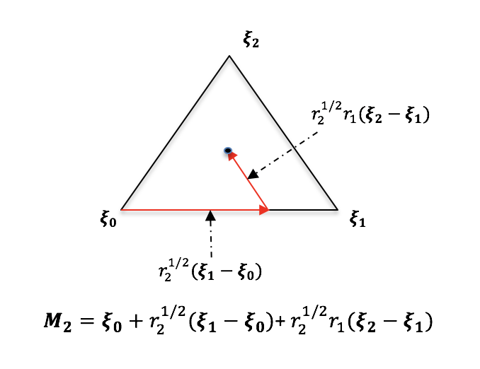

.. _samplemethods_doc:

		  		   
SampleMethods
=============

.. automodule:: UQpy.SampleMethods

MCS
----

The ``MCS`` class generates random samples from a specified probability distribution(s).  The ``MCS`` class utilizes the ``Distributions`` class to define probability distributions.  The advantage of using the ``MCS`` class for ``UQpy`` operations, as opposed to simply generating samples with the ``scipy.stats`` package, is that it allows building an object containing the samples and their distributions for integration with other ``UQpy`` modules.

MCS Class Descriptions
^^^^^^^^^^^^^^^^^^^^^^^^^^^^^^^^^^^^^^

.. autoclass:: UQpy.SampleMethods.MCS
	:members:

LHS
----

The ``LHS`` class generates random samples from a specified probability distribution(s) using Latin hypercube sampling. LHS has the advantage that the samples generated are uniformly distributed over each marginal distribution. LHS is perfomed by dividing the range of each random variable into N bins with equal probability mass, where N is the required number of samples, generating one sample per bin, and then randomly pairing the samples.

Adding New Latin Hypercube Design Criteria
^^^^^^^^^^^^^^^^^^^^^^^^^^^^^^^^^^^^^^^^^^^^
	 
The ``LHS`` class offers a variety of methods for pairing the samples in a Latin hypercube design. These are specified by the `criterion` parameter (i.e. 'random', 'centered', 'minmax', 'correlate'). However, adding a new method is straightforward. This is done by creating a new method that contains the algorithm for pairing the samples. This method takes as input the randomly generated samples in equal probability bins in each dimension and returns a set of samples that is paired according to the user's desired criterion. The user may also pass criterion-specific parameters into the custom method. These parameters are input to the ``LHS`` class through the `**kwargs`. The output of this function should be a numpy array of at least two-dimensions with the first dimension being the number of samples and the second dimension being the number of variables . An example user-defined criterion is given below:

	
>>> def criterion(samples):
>>> 	lhs_samples = np.zeros_like(samples)
>>> 	for j in range(samples.shape[1]):
>>> 		order = np.random.permutation(samples.shape[0])
>>> 		lhs_samples[:, j] = samples[order, j]
>>> 	return lhs_samples

LHS Class Descriptions
^^^^^^^^^^^^^^^^^^^^^^^^^^^^^^^^^^^^^^

.. autoclass:: UQpy.SampleMethods.LHS
	:members:

Stratified Sampling
---------------------

Stratified sampling is a variance reduction technique that divides the parameter space into a set of disjoint and space-filling strata. Samples are then drawn from these strata in order to improve the space-filling properties of the sample design. Stratified sampling allows for unequally weighted samples, such that a Monte Carlo estimator of the quantity :math:`E[Y]` takes the following form:

.. math:: E[Y] \approx \sum_{i=1}^N w_i Y_i

where :math:`w_i` are the sample weights and :math:`Y_i` are the model evaluations. The individual sample weights are computed as:

.. math:: w_i = \dfrac{V_{i}}{N_{i}}

where :math:`V_{i}\le 1` is the volume of stratum :math:`i` in the unit hypercube (i.e. the probability that a random sample will fall in stratum :math:`i`) and :math:`N_{i}` is the number of samples drawn from stratum :math:`i`.

``UQpy`` supports several stratified sampling variations that vary from conventional stratified sampling designs to advanced gradient informed methods for adaptive stratified sampling. Stratified sampling capabilities are built in ``UQpy`` from three sets of classes. These class structures facilitate a highly flexible and varied range of stratified sampling designs that can be extended in a straightforward way. Specifically, the existing classes allow stratification of n-dimensional parameter spaces based on three common spatial discretizations: a rectilinear decomposition into hyper-rectangles (orthotopes), a Voronoi decomposition, and a Delaunay decomposition. The three parent classes are:

1. The ``Strata`` class defines the geometric structure of the stratification of the parameter space and it has three existing subclasses - ``RectangularStrata``, ``VoronoiStrata``, and ``DelaunayStrata`` that correspond to geometric decompositions of the parameter space based on rectilinear strata of orthotopes, strata composed of Voronoi cells, and strata composed of Delaunay simplexes respectively.

2. The ``STS`` class defines a set of subclasses used to draw samples from strata defined by a ``Strata`` class object.

3. The ``RSS`` class defines a set of subclasses for refinement of ``STS`` stratified sampling designs.

New Stratified Sampling Methods
^^^^^^^^^^^^^^^^^^^^^^^^^^^^^^^^

Extension of the stratified sampling capabilities in ``UQpy`` can be performed through subclassing from the three main classes. First, the user can define a new geometric decomposition of the parameter space by creating a new subclass of the ``Strata`` class. To draw samples from this  new stratification, the user can define a new subclass of the ``STS`` class. Finally, to enable refinement of the strata based on any user-specified criteria the user can define a new subclass of the ``RSS`` class. 

In summary:

To implement a new stratified sampling method based on a new stratification, the user must write two new classes:

1. A new subclass of the ``Strata`` class defining the new decomposition.
2. A new subclass of the ``STS`` class to perform the sampling from the newly design ``Strata`` class.

To implement a new refined stratified sampling method based on a new stratified, the user must write three new classes:

1. A new subclass of the ``Strata`` class defining the new decomposition.
2. A new subclass of the ``STS`` class to perform the sampling from the newly design ``Strata`` class.
3. A new subclass of the ``RSS`` class to perform the stratum refinement and subsequent sampling.

The details of these subclasses and their requirements are outlined in the sections below discussing the respective classes.

Strata Class
^^^^^^^^^^^^^

The ``Strata`` class is the parent class that defines the geometric decomposition of the parameter space. All geometric decompositions in the ``Strata`` class are performed on the `n`-dimensional unit :math:`[0, 1]^n` hypercube. Specific stratifications are performed by subclassing the ``Strata`` class. There are currently three stratifications available in the ``Strata`` class, defined through the subclasses ``RectangularStrata``, ``VoronoiStrata``, and ``DelaunayStrata``. 

Strata Class Descriptions
^^^^^^^^^^^^^^^^^^^^^^^^^^^^^^^^^^^^^^

.. autoclass:: UQpy.SampleMethods.Strata
	:members:
	
.. autoclass:: UQpy.SampleMethods.RectangularStrata
	:members:
	
.. autoclass:: UQpy.SampleMethods.VoronoiStrata
	:members:
	
.. autoclass:: UQpy.SampleMethods.DelaunayStrata
	:members:
	
Adding a new ``Strata`` class
^^^^^^^^^^^^^^^^^^^^^^^^^^^^^^^^^^^^^^^^^^^^^^^^^^^^^^

Adding a new type of stratification requires creating a new subclass of the ``Strata`` class that defines the desired geometric decomposition. This subclass must have a ``stratify`` method that overwrites the corresponding method in the parent class and performs the stratification.
	

STS Class
^^^^^^^^^^^

The ``STS`` class is the parent class for stratified sampling. The various ``STS`` classes generate random samples from a specified probability distribution(s) using stratified sampling with strata specified by an object of one of the ``Strata`` classes. The ``STS`` class currently has three child classes - ``RectangularSTS``, ``VoronoiSTS``, and ``DelaunaySTS`` - corresponding to stratified sampling methods based rectangular, Voronoi, and Delaunay strata respectively. The following details these classes.

STS Class Descriptions
^^^^^^^^^^^^^^^^^^^^^^^^^^^^^^^^^^^^^^

.. autoclass:: UQpy.SampleMethods.STS
	:members:

.. autoclass:: UQpy.SampleMethods.RectangularSTS
	:members:
	
.. autoclass:: UQpy.SampleMethods.VoronoiSTS
	:members:
	
.. autoclass:: UQpy.SampleMethods.DelaunaySTS
	:members:

Adding a new ``STS`` class
^^^^^^^^^^^^^^^^^^^^^^^^^^^

Adding a new stratified sampling method first requires that an appropriate ``Strata`` class exists. If the new method is based on rectangular, Voronoi, or Delaunay stratification one of the existing ``Strata`` classes can be used. If it relies on a different type of stratification, then a new ``Strata`` class must be written first. Next, the new stratified sampling method must be written as a new subclass of the ``STS`` class containing a ``create_samplesu01`` method that performs the stratified sampling on the unit hypercube. This method must take input that are consistent with the ``create_samplesu01`` method described in the ``STS`` class above.

Refined Stratified Sampling
-----------------------------

Refined Stratified Sampling (RSS) is a sequential sampling procedure that adaptively refines the stratification of the parameter space to add samples. There are four variations of RSS currently available in ``UQpy``. First, the procedure works with either rectangular stratification (i.e. using ``RectangularStrata``) or Voronoi stratification (i.e. using ``VoronoiStrata``). For each of these, two refinement procedures are available. The first is a randomized algorithm where strata are selected at random according to their probability weight. This algorithm is described in [10]_. The second is a gradient-enhanced version (so-called GE-RSS) that draws samples in stata that possess both large probability weight and have high variance. This algorithm is described in [11]_.

RSS Class
^^^^^^^^^^

All variations of Refined Stratifed Sampling are implemented in the ``RSS`` class. ``RSS`` is the parent class that includes all Refined Stratified Sampling algorithms, which are implemented as child class, specifically ``RectangularRSS`` and ``VoronoiRSS``. The details of these classes are provided below. 

Extension of the RSS class for new algorithms can be accomplished by adding new a new child class with the appropriate algorithm. Depending on the type of stratification, this may require the additional development of new ``Strata`` and ``STS`` classes to accommodate the RSS. This is discussed in more details below.

RSS Class Descriptions
^^^^^^^^^^^^^^^^^^^^^^^^^^^^^^^^^^^^^^

.. autoclass:: UQpy.SampleMethods.RSS
	:members:
	
.. autoclass:: UQpy.SampleMethods.RectangularRSS
	:members:

.. autoclass:: UQpy.SampleMethods.VoronoiRSS
	:members:
	
Adding a new ``RSS`` class
^^^^^^^^^^^^^^^^^^^^^^^^^^^

New refined stratified sampling methods can be implemented by subclassing the ``RSS`` class. The subclass should inherit inputs from the parent class and may also take additional inputs as necessary. Any ``RSS`` subclass must have a ``run_rss`` method that is invoked by the ``RSS.run`` method. The ``run_rss`` method is an instance method that should not take any additional arguments and executes the refined stratifed sampling algorithm.

It is noted that any new ``RSS`` class must have a corresponding ``Strata`` object that defines the type of stratification and may also require a corresponding ``STS`` class. New ``RSS`` algorithms that do not utilize the existing ``Strata`` classes (``RectangularStrata``, ``VoronoiStrata``, or ``DelaunayStrata``) will require that a new ``Strata`` subclass be written.

Simplex
-------

The ``Simplex`` class generates uniformly distributed samples inside a simplex of dimension :math:`n_d`, whose coordinates are expressed by :math:`\zeta_k`. First, this class generates :math:`n_d` independent uniform random variables on [0, 1], denoted :math:`r_q`, then maps them to the simplex as follows:

.. math:: \mathbf{M_{n_d}} = \zeta_0 + \sum_{i=1}^{n_d} \Big{[}\prod_{j=1}^{i} r_{n_d-j+1}^{\frac{1}{n_d-j+1}}\Big{]}(\zeta_i - \zeta_{i-1})

where :math:`M_{n_d}` is an :math:`n_d` dimensional array defining the coordinates of new sample. This mapping is illustrated below for a two-dimensional simplex.

   
Additional details can be found in [8]_.

Simplex Class Descriptions
^^^^^^^^^^^^^^^^^^^^^^^^^^^^^^^^^^^^^^

.. autoclass:: UQpy.SampleMethods.Simplex
	:members:

AKMCS
-----

The ``AKMCS`` class generates samples adaptively using a specified Kriging-based learning function in a general Adaptive Kriging-Monte Carlo Sampling (AKMCS) framework. Based on the specified learning function, different objectives can be achieved. In particular, the ``AKMCS`` class has learning functions for reliabliity analysis (probability of failure estimation), global optimization, best global fit surrogate models, and can also accept user-defined learning functions for these and other objectives.  Note that the term AKMCS is adopted from [3]_ although the procedure is referred to by different names depending on the specific learning function employed. For example, when applied for optimization the algorithm leverages the expected improvement function and is known under the name Efficient Global Optimization (EGO) [4]_. 

Learning Functions
^^^^^^^^^^^^^^^^^^^^
``AKMCS`` provides a number of built-in learning functions as well as allowing the user to proviee a custom learning function. These learning functions are described below.

U-Function
~~~~~~~~~~~~

The U-function is a learning function adopted for Kriging-based reliability analysis adopted from [3]_. Given a Kriging model :math:`\hat{y}(\mathbf{x})`, point estimator of its standard devaition :math:`\sigma_{\hat{y}}(\mathbf{x})`, and a set of learning points :math:`S`, the U-function seeks out the point :math:`\mathbf{x}\in S` that minimizes the function:

.. math:: U(\mathbf{x}) = \dfrac{|\hat{y}(\mathbf{x})|}{\sigma_{\hat{y}}(\mathbf{x})}

This point can be interpreted as the point in :math:`S` where the Kriging model has the highest probabability of incorrectly identifying the sign of the performance function (i.e. incorrectly predicting the safe/fail state of the system).

The ``AKMCS`` then adds the corresponding point to the training set, re-fits the Kriging model and repeats the procedure until the following stopping criterion in met:

.. math:: \min(U(\mathbf{x})) > \epsilon_u

where :math:`\epsilon_u` is a user-defined error threshold (typically set to 2).

Weighted U-Function
~~~~~~~~~~~~~~~~~~~~~

The probability weighted U-function is a learning function for reliability analysis adapted from the U-function in [5]_. It modifies the U-function as follows:

.. math:: W(\mathbf{x}) = \dfrac{\max_x[p(\mathbf{x})] - p(\mathbf{x})}{\max_x[p(\mathbf{x})]} U(\mathbf{x})

where :math:`p(\mathbf{x})` is the probability density function of :math:`\mathbf{x}`. This has the effect of decreasing the learning function for points that have higher probability of occurrence. Thus, given two points with identical values of :math:`U(x)`, the weighted learning function will select the point with higher probability of occurrence.

As with the standard U-function, ``AKMCS`` with the weighted U-function iterates until :math:`\min(U(\mathbf{x})) > \epsilon_u` (the same stopping criterion as the U-function).

Expected Feasibility Function
~~~~~~~~~~~~~~~~~~~~~~~~~~~~~~~~

The Expected Feasibility Function (EFF) is a learning function for reliability analysis introduced as part of the Efficient Global Reliability Analysis (EGRA) method [6]_. The EFF provides assesses how well the true value of the peformance function, :math:`y(\mathbf{x})`, is expected to satisfy the constraint :math:`y(\mathbf{x}) = a` over a region :math:`a-\epsilon \le y(\mathbf{x}) \le a+\epsilon`. It is given by:

.. math:: \begin{align} EFF(\mathbf{x}) &= (\hat{y}(\mathbf{x})-a)\bigg[2\Phi\bigg(\dfrac{a-\hat{y}(\mathbf{x})}{\sigma_{\hat{y}}(\mathbf{x})} \bigg) - \Phi\bigg(\dfrac{(a-\epsilon)-\hat{y}(\mathbf{x})}{\sigma_{\hat{y}}(\mathbf{x})} \bigg) - \Phi\bigg(\dfrac{(a+\epsilon)-\hat{y}(\mathbf{x})}{\sigma_{\hat{y}}(\mathbf{x})} \bigg) \bigg] \\ &-\sigma_{\hat{y}}(\mathbf{x})\bigg[2\phi\bigg(\dfrac{a-\hat{y}(\mathbf{x})}{\sigma_{\hat{y}}(\mathbf{x})} \bigg) - \phi\bigg(\dfrac{(a-\epsilon)-\hat{y}(\mathbf{x})}{\sigma_{\hat{y}}(\mathbf{x})} \bigg) - \phi\bigg(\dfrac{(a+\epsilon)-\hat{y}(\mathbf{x})}{\sigma_{\hat{y}}(\mathbf{x})} \bigg) \bigg] \\ &+ \bigg[ \Phi\bigg(\dfrac{(a+\epsilon)-\hat{y}(\mathbf{x})}{\sigma_{\hat{y}}(\mathbf{x})} \bigg) - \Phi\bigg(\dfrac{(a-\epsilon)-\hat{y}(\mathbf{x})}{\sigma_{\hat{y}}(\mathbf{x})} \bigg) \bigg] \end{align}

where :math:`\Phi(\cdot)` and :math:`\phi(\cdot)` are the standard normal cdf and pdf, respectively. For reliabilty, :math:`a=0`, and it is suggest to use :math:`\epsilon=2\sigma_{\hat{y}}^2`. 

At each iteration, the new point that is selected is the point that maximizes the EFF and iterations continue until 

.. math:: \max_x(EFF(\mathbf{x})) < \epsilon_{eff}

Expected Improvement Function
~~~~~~~~~~~~~~~~~~~~~~~~~~~~~~~~

The Expected Improvement Function (EIF) is a Kriging-based learning function for global optimization introduced as part of the Efficient Global Optimization (EGO) method in [4]_. The EIF seeks to find the global minimum of a function. It searches the space by placing samples at locations that maximize the expected improvement, where the improvement is defined as :math:`I(\mathbf{x})=\max(y_{min}-y(\mathbf{x}), 0)`, where the model response :math:`y(\mathbf{x})` is assumed to be a Gaussian random variable and :math:`y_{min}` is the current minimum model response. The EIF is then expressed as:

.. math:: EIF(\mathbf{x}) = E[I(\mathbf{x})] = (y_{min}-\hat{y}(\mathbf{x})) \Phi \bigg(\dfrac{y_{min}-\hat{y}(\mathbf{x})}{\sigma_{\hat{y}}(\mathbf{x})} \bigg) + \sigma_{\hat{y}}(\mathbf{x})\phi \bigg(\dfrac{y_{min}-\hat{y}(\mathbf{x})}{\sigma_{\hat{y}}(\mathbf{x})} \bigg)

where :math:`\Phi(\cdot)` and :math:`\phi(\cdot)` are the standard normal cdf and pdf, respectively. 

At each iteration, the EGO algorithm selects the point in the learning set that maximizes the EIF. The algorithm continues until the maximum number of iterations or until:

.. math:: \dfrac{EIF(\mathbf{x})}{|y_{min}|} < \epsilon_{eif}.

Typically a value of 0.01 is used for :math:`\epsilon_{eif}`.

Expected Improvement for Global Fit
~~~~~~~~~~~~~~~~~~~~~~~~~~~~~~~~~~~~~~

The Expected Improvement for Global Fit (EIGF) learning function aims to build the surrogate model that is the best global representation of model. It was introduced in [7]_. It aims to balance between even space-filling design and sampling in regions of high variation and is given by:

.. math:: EIGF(\mathbf{x}) = (\hat{y}(\mathbf{x}) - y(\mathbf{x}_*))^2 + \sigma_{\hat{y}}(\mathbf{x})^2

where :math:`\mathbf{x}_*` is the point in the training set closest in distance to the point :math:`\mathbf{x}` and :math:`y(\mathbf{x}_*)` is the model response at that point.

No stopping criterion is suggested by the authors of [7]_, thus its implementation in ``AKMCS`` uses a fixed number of iterations.

User-Defined Learning Functions
~~~~~~~~~~~~~~~~~~~~~~~~~~~~~~~~~~

The ``AKMCS`` class also allows new, user-defined learning functions to be specified in a straightforward way. This is done by creating a new method that contains the algorithm for selecting a new samples. This method takes as input the surrogate model, the randomly generated learning points, the number of points to be added in each iteration, any requisite parameters including a stopping criterion, existing samples, model evaluate at samples and distribution object. It returns a set of samples that are selected according to the user's desired learning function and the corresponding learning function values. The outputs of this function should be (1) a numpy array of samples to be added; (2) the learning function values at the new sample points, and (3) a boolean stopping criterion indicating whether the iterations should continue (`False`) or stop (`True`). The numpy array of samples should be a two-dimensional array with the first dimension being the number of samples and the second dimension being the number of variables. An example user-defined learning function is given below:

>>> def u_function(surr, pop, n_add, parameters, samples, qoi, dist_object):
>>> 	g, sig = surr(pop, True)
>>> 	g = g.reshape([pop.shape[0], 1])
>>> 	sig = sig.reshape([pop.shape[0], 1])
>>> 	u = abs(g) / sig
>>>     rows = u[:, 0].argsort()[:n_add]
>>> 	new_samples = pop[rows, :]
>>>     u_lf = u[rows, 0]
>>>     indicator = False
>>>     if min(u[:, 0]) >= parameters['u_stop']:
>>>         indicator = True
>>> 	return new_samples, u_lf, indicator

AKMCS Class Descriptions
^^^^^^^^^^^^^^^^^^^^^^^^^^^^^^^^^^^^^^

.. autoclass:: UQpy.SampleMethods.AKMCS
	:members:

MCMC
----

The goal of Markov Chain Monte Carlo is to draw samples from some probability distribution :math:`p(x)=\frac{\tilde{p}(x)}{Z}`, where :math:`\tilde{p}(x)` is known but :math:`Z` is hard to compute (this will often be the case when using Bayes' theorem for instance). In order to do this, the theory of a Markov chain, a stochastic model that describes a sequence of states in which the probability of a state depends only on the previous state, is combined with a Monte Carlo simulation method, see e.g. ([1]_, [2]_). More specifically, a Markov Chain is built and sampled from whose stationary distribution is the target distribution :math:`p(x)`.  For instance, the Metropolis-Hastings (MH) algorithm goes as follows:

* initialize with a seed sample :math:`x_{0}`
* walk the chain: for :math:`k=0,...` do:
   * sample candidate :math:`x^{\star} \sim Q(\cdot \vert x_{k})` for a given Markov transition probability :math:`Q`
   * accept candidate (set :math:`x_{k+1}=x^{\star}`) with probability :math:`\alpha(x^{\star} \vert x_{k})`, otherwise propagate last sample :math:`x_{k+1}=x_{k}`.
   
.. math:: \alpha(x^{\star} \vert x_{k}):= \min \left\{ \frac{\tilde{p}(x^{\star})}{\tilde{p}(x)}\cdot \frac{Q(x \vert x^{\star})}{Q(x^{\star} \vert x)}, 1 \right\}
     
The transition probability :math:`Q` is chosen by the user (see input `proposal` of the MH algorithm, and careful attention must be given to that choice as it plays a major role in the accuracy and efficiency of the algorithm. The following figure shows samples accepted (blue) and rejected (red) when trying to sample from a 2d Gaussian distribution using MH, for different scale parameters of the proposal distribution. If the scale is too small, the space is not well explored; if the scale is too large, many candidate samples will be rejected, yielding a very inefficient algorithm. As a rule of thumb, an acceptance rate of 10\%-50\% could be targeted (see `Diagnostics` in the `Utilities` module).

.. image:: _static/SampleMethods_MCMC_samples.png
   :scale: 40 %
   :alt: IS weighted samples
   :align: center

Finally, samples from the target distribution will be generated only when the chain has converged to its stationary distribution, after a so-called burn-in period. Thus the user would often reject the first few samples (see input `nburn`). Also, the chain yields correlated samples; thus to obtain i.i.d. samples from the target distribution, the user should keep only one out of n samples (see input `jump`). This means that the code will perform in total nburn + jump * N evaluations of the target pdf to yield N i.i.d. samples from the target distribution (for the MH algorithm with a single chain).

The parent class for all MCMC algorithms is the ``MCMC class``, which defines the inputs that are common to all MCMC algorithms, along with the ``run`` method that is being called to run the chain. Any given MCMC algorithm is a child class of MCMC that overwrites the main ``run_one_iteration`` method.

Adding New MCMC Algorithms
^^^^^^^^^^^^^^^^^^^^^^^^^^^^^^^^^^^^^^^^^^^^

In order to add a new MCMC algorithm, a user must create a child class of ``MCMC``, and overwrite the ``run_one_iteration`` method that propagates all the chains forward one iteration. Such a new class may use any number of additional inputs compared to the ``MCMC`` base class. The reader is encouraged to have a look at the ``MH`` class and its code to better understand how a particular algorithm should fit the general framework. 

A useful note is that the user has access to a number of useful attributes / utility methods as the algorithm proceeds, such as:

* the attribute ``evaluate_log_target`` (and possibly ``evaluate_log_target_marginals`` if marginals were provided) is created at initialization. It is a callable that simply evaluates the log-pdf of the target distribution at a given point `x`. It can be called within the code of a new sampler as ``log_pdf_value = self.evaluate_log_target(x)``. 
* the `nsamples` and `nsamples_per_chain` attributes indicate the number of samples that have been stored up to the current iteration (i.e., they are updated dynamically as the algorithm proceeds),
* the `samples` attribute contains all previously stored samples. Cautionary note: `self.samples` also contains trailing zeros, for samples yet to be stored, thus to access all previously stored samples at a given iteration the user must call ``self.samples[:self.nsamples_per_chain]``, which will return an `ndarray` of size (self.nsamples_per_chain, self.nchains, self.dimension) ,
* the `log_pdf_values` attribute contains all previously stored log target values. Same cautionary note as above,
* the ``_update_acceptance_rate`` method updates the `acceptance_rate` attribute of the sampler, given a (list of) boolean(s) indicating if the candidate state(s) were accepted at a given iteration,
* the ``_check_methods_proposal`` method checks whether a given proposal is adequate (i.e., has ``rvs`` and ``log_pdf``/``pdf`` methods).

MCMC Class Descriptions
^^^^^^^^^^^^^^^^^^^^^^^^^^^^^^^^^^^^^^^

.. autoclass:: UQpy.SampleMethods.MCMC
   :members:

MH
~~~~~

.. autoclass:: UQpy.SampleMethods.MH
	:members:

MMH
~~~~~
   
.. autoclass:: UQpy.SampleMethods.MMH
	:members:

Stretch
~~~~~~~~
   
.. autoclass:: UQpy.SampleMethods.Stretch
	:members:

DRAM
~~~~~~~
   
.. autoclass:: UQpy.SampleMethods.DRAM
	:members:

DREAM
~~~~~~~
   
.. autoclass:: UQpy.SampleMethods.DREAM
	:members:

   
IS
----

Importance sampling (IS) is based on the idea of sampling from an alternate distribution and reweighting the samples to be representative of the target distribution (perhaps concentrating sampling in certain regions of the input space that are of greater importance). This often enables efficient evaluations of expectations :math:`E_{ \textbf{x} \sim p} [ f(\textbf{x}) ]` where :math:`f( \textbf{x})` is small outside of a small region of the input space. To this end, a sample :math:`\textbf{x}` is drawn from a proposal distribution :math:`q(\textbf{x})` and re-weighted to correct for the discrepancy between the sampling distribution :math:`q` and the true distribution :math:`p`. The weight of the sample is computed as 

.. math:: w(\textbf{x}) = \frac{p(\textbf{x})}{q(\textbf{x})}

If :math:`p` is only known up to a constant, i.e., one can only evaluate :math:`\tilde{p}(\textbf{x})`, where :math:`p(\textbf{x})=\frac{\tilde{p}(\textbf{x})}{Z}`, IS can be used by further normalizing the weights (self-normalized IS). The following figure shows the weighted samples obtained when using IS to estimate a 2d Gaussian target distribution :math:`p`, sampling from a uniform proposal distribution :math:`q`.

.. image:: _static/SampleMethods_IS_samples.png
   :scale: 40 %
   :alt: IS weighted samples
   :align: center
   
   
IS Class Descriptions
^^^^^^^^^^^^^^^^^^^^^^^^^^^^^^^^^^^^^^^
   
.. autoclass:: UQpy.SampleMethods.IS
   :members:
   
.. [1] Gelman et al., "Bayesian data analysis", Chapman and Hall/CRC, 2013
.. [2] R.C. Smith, "Uncertainty Quantification - Theory, Implementation and Applications", CS&E, 2014
.. [3] B. Echard, N. Gayton and M. Lemaire, "AK-MCS: An active learning reliability method combining Kriging and Monte Carlo Simulation", Structural Safety, Pages 145-154, 2011.
.. [4] Jones, D. R., Schonlau, M., & Welch, W. J. "Efficient global optimization of expensive black-box functions." Journal of Global optimization, 13(4), 455-492, 1998.
.. [5] V.S. Sundar and Shields, M.D. "Reliablity analysis using adaptive Kriging surrogates and multimodel inference." ASCE-ASME Journal of Risk and Uncertainty in Engineering Systems. Part A: Civil Engineering. 5(2): 04019004, 2019.
.. [6] B.J. Bichon, M.S. Eldred, L.P. Swiler, S. Mahadevan, and J.M. McFarland. "Efficient global reliablity analysis for nonlinear implicit performance functions." AIAA Journal. 46(10) 2459-2468, (2008).
.. [7] C.Q. Lam. "Sequential adaptive designs in computer experiments for response surface model fit." PhD diss., The Ohio State University, 2008.
.. [8] W. N. Edeling, R. P. Dwight, P. Cinnella, "Simplex-stochastic collocation method with improved scalability", Journal of Computational Physics, 310:301–328, 2016.
.. [9] K. Tocher. "The art of simulation." The English Universities Press, London, UK; 1963.
.. [10] M.D. Shields, K. Teferra, A. Hapij, and R.P. Daddazio, "Refined Stratified Sampling for efficient Monte Carlo based uncertainty quantification," Reliability Engineering and System Safety,vol.142, pp.310-325,2015.
.. [11] M.D. Shields, "Adaptive Monte Carlo analysis for strongly nonlinear stochastic systems." Reliability Engineering & System Safety 175 (2018): 207-224.

.. toctree::
    :maxdepth: 2

	
	