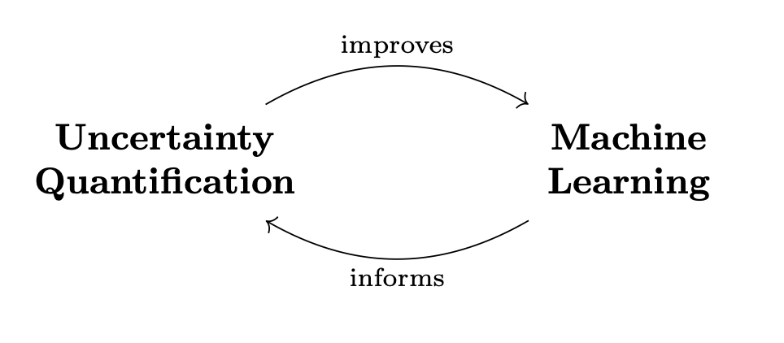

Scientific Machine Learning
===========================

This module contains functionality for Scientific Machine Learning methods supported in :py:mod:`UQpy`.
This package focuses on supervised machine learning, specifically on the architecture and training of Neural Networks.

This module is *not* intended as a standalone package for neural networks.
It is designed as an extension of `pytorch <https://pytorch.org/>`_ and, as much as practical,
we borrow their syntax and notation to implement UQ methods in a compatible way.
For example, the Bayesian counterpart of torch's ``Linear`` layer is UQpy's ``BayesianLinear``,
which uses similar inputs.

   The relationship between UQ4ML and ML4UQ.

The module contains the following parent classes:

- :class:`ActivationFunction`: Parent class to all activation functions. Subclass of :class:`torch.nn.Module`.
- :class:`BayesianLayer`: Parent class to all Bayesian layers. Subclass of :class:`Layer`
- :class:`.Layer`: Parent class to all Neural Network Layers. Subclass of :class:`torch.nn.Module`.
- :class:`.Loss`: Parent class to all Loss functions. Subclass of :class:`torch.nn.Module`.
- :class:`.NeuralNetwork`: Parent class to all Neural Networks and Neural Operators.  Subclass of :class:`torch.nn.Module`.

.. toctree::
   :maxdepth: 1
   :caption: Scientific Machine Learning

    Activation Functions <activation_functions/index>
    Layers <layers/index>
    Loss Functions <losses>
    Neural Networks <neural_networks/index>
    Trainers <trainers/index>
