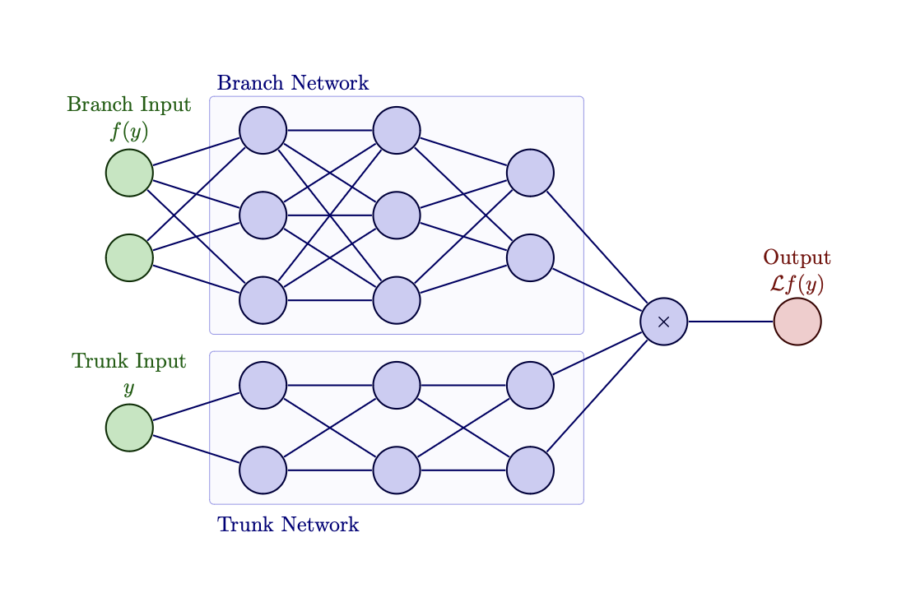

Deep Operator Network (DeepONet)
~~~~~~~~~~~~~~~~~~~~~~~~~~~~~~~~

Implementation of the Deep Operator Network (DeepONet) as defined by Lu 2021.
The deep operator network is defined by its branch and trunk networks, as shown below.

   The architecture of a generic deep operator network.

The :class:`.DeepOperatorNetwork` class is imported using the following command:

>>> from UQpy.scientific_machine_learning.neural_networks.DeepOperatorNetwork import DeepOperatorNetwork

Methods
-------

.. autoclass:: UQpy.scientific_machine_learning.neural_networks.DeepOperatorNetwork
    :members: forward, train

Attributes
----------

.. autoattribute:: UQpy.scientific_machine_learning.neural_networks.DeepOperatorNetwork.branch_network
.. autoattribute:: UQpy.scientific_machine_learning.neural_networks.DeepOperatorNetwork.trunk_network

Examples
--------

.. toctree::

   All Examples <../../auto_examples/scientific_machine_learning/deep_operator_network/index>
   Integral 1D <../../auto_examples/scientific_machine_learning/deep_operator_network/integral_1d>
   Laplacian 2D <../../auto_examples/scientific_machine_learning/deep_operator_network/laplacian_2d>