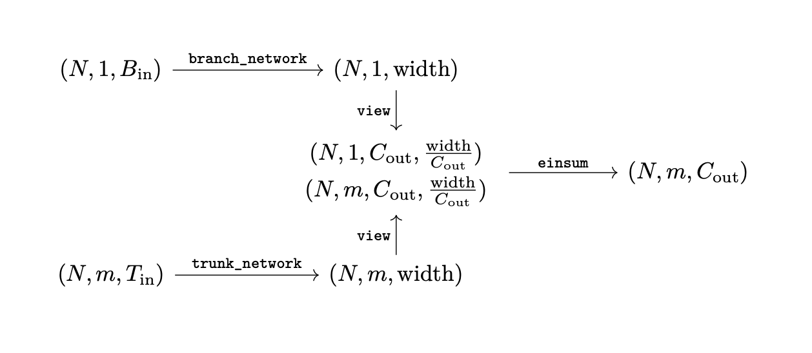

Deep Operator Network (DeepONet)
~~~~~~~~~~~~~~~~~~~~~~~~~~~~~~~~

Implementation of the Deep Operator Network (DeepONet) as defined by Lu 2021.
The deep operator network is defined by its branch and trunk networks, as shown below.

.. figure:: ./figures/deep_operator_network_diagram.png
   :align: center
   :class: with-border
   :width: 600
   :alt: A diagram showing the architecture of a deep operator network.

   The architecture of a generic deep operator network.

The :class:`.DeepOperatorNetwork` class is imported using the following command:

>>> from UQpy.scientific_machine_learning import DeepOperatorNetwork

Methods
-------

.. autoclass:: UQpy.scientific_machine_learning.neural_networks.DeepOperatorNetwork
    :members: forward, summary, count_parameters, drop, sample, is_deterministic, set_deterministic

Note the branch network should map a tensor of shape :math:`(N, 1, B_\text{in})` to :math:`(N, 1, \text{width})`
and the trunk network should map a tensor of shape :math:`(N, m, T_\text{in})` to :math:`(N, m, \text{width})`,
where :math:`\text{width}` is the width of the final layer in both networks.
The :py:class:`DeepOperatorNetwork` maps the 3d branch and trunk outputs to 4d tensors of shape
:math:`(*, *, C_\text{out}, \frac{\text{width}}{C_\text{out}})`,
where :math:`*` is the respective dimension of the tensor, before applying :func:`torch.einsum`.
The intermediary tensor shapes are summarized in the figure below.

   The shapes of the input, intermediary, and output tensors of the Deep Operator Network.

Attributes
----------

.. autoattribute:: UQpy.scientific_machine_learning.neural_networks.DeepOperatorNetwork.branch_network
.. autoattribute:: UQpy.scientific_machine_learning.neural_networks.DeepOperatorNetwork.trunk_network

Examples
--------

.. toctree::

   All Examples <../../auto_examples/scientific_machine_learning/deep_operator_network/index>
   Integral 1D <../../auto_examples/scientific_machine_learning/deep_operator_network/integral_1d>
   Laplacian 2D <../../auto_examples/scientific_machine_learning/deep_operator_network/laplacian_2d>