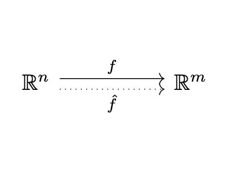
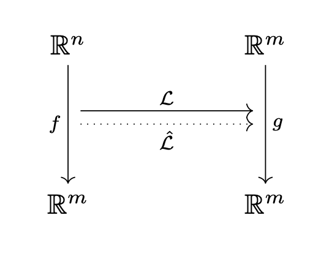

Neural Networks
===============
This file is a placeholder for the Neural Network documentation.

Neural Operators - Theory
^^^^^^^^^^^^^^^^^^^^^^^^^

Traditionally, neural networks learn a mapping between vector spaces, such as :math:`f: \mathbb{R}^n \to \mathbb{R}^m`.
The function :math:`f` maps on vector to another, such as the features of an image to a classification.
We denote the neural network's approximation as :math:`\hat{f}`, and can visualize this relationship below.

   Neural networks approximate a function between vectors.

In contrast, neural operators do not map one vector to another.
Rather, neural operators map a function to another function as :math:`\mathcal{L}: f \to g`.
Common examples include the derivative and integral operators, that map functions as their name suggests.
Other examples include the fourier transform :math:`\mathcal{F}` that maps a function in time to a function in frequency.

In the context of differential equations, we are given the operator :math:`\mathcal{L}` and the
function :math:`g`, and are trying to find solutions to the equation :math:`\mathcal{L}f = g`.
Here the operator might be the Laplacian :math:`\mathcal{L}f := \nabla^2 f`, or some second order differential
:math:`\mathcal{L}f := af''(x) + bf'(x) + cf`.

Neural operators deviate from the typical differential equation problem by assuming both :math:`f` and :math:`g` are
given and trying to find the operator :math:`\mathcal{L}` that satisfies :math:`\mathcal{L}f = g`.
Rather than trying to find :math:`\mathcal{L}` symbolically, we train a neural network to find an approximation that we
denote :math:`\hat{\mathcal{L}}`. We can visualize this relationship as:

   Neural operators approximate an operator between functions.

This requires many realizations of :math:`f` paired with the output :math:`g` and we
try to find an approximation :math:`\hat{\mathcal{L}}` that minimizes the loss on the input-output pairs.
This framework is further explored in the section below.

Neural Operators - Practice
^^^^^^^^^^^^^^^^^^^^^^^^^^^

This is a placeholder on the discretization of neural operators.

List of Neural Networks
^^^^^^^^^^^^^^^^^^^^^^^

.. toctree::
   :maxdepth: 1

    Neural Network Parent Class <neural_network_parent>
    Deep Operator Network <deep_operator_network>
    Feed Forward Neural Network <feed_forward_neural_network>
    Fourier Neural Operator <fourier_neural_network>
    U-Shaped Neural Network <u_neural_network>
