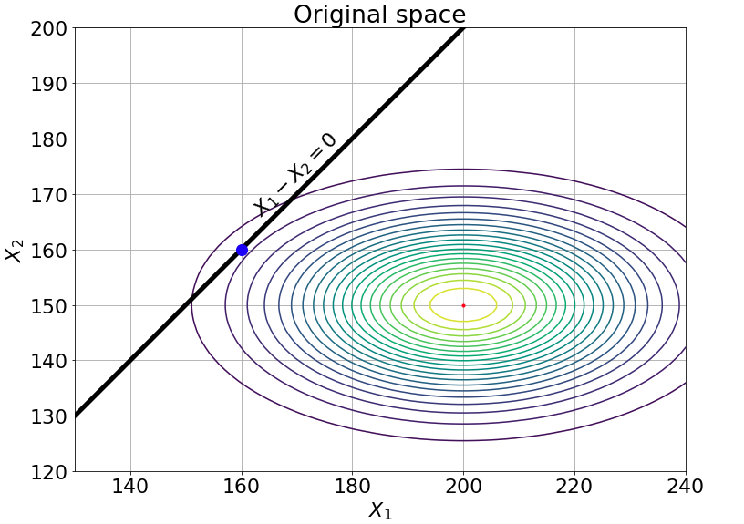

.. _reliability:

Reliability
===========

Reliability of a system refers to the assessment of its probability failure (i.e the structure no longer satisfies some performance measures), given the model uncertainty in the structural, environmental and load parameters. Given a vector of random variables :math:`\textbf{X}=\{X_1, X_2, \ldots, X_n\} \in \mathcal{D}_\textbf{X}\subset \mathbb{R}^n`, where :math:`\mathcal{D}` is the domain of interest and :math:`f_{\textbf{X}}(\textbf{x})` is its joint probability density function then, the probability that the system will fail is defined as

.. math:: P_f =\mathbb{P}(g(\textbf{X}) \leq 0) = \int_{D_f} f_{\textbf{X}}(\textbf{x})d\textbf{x} = \int_{\{\textbf{X}:g(\textbf{X})\leq 0 \}} f_{\textbf{X}}(\textbf{x})d\textbf{x}

where :math:`g(\textbf{X})` is the so-called performance function. Formulation of reliability methods in ``UQpy`` is made on the standard normal space :math:`\textbf{U}\sim \mathcal{N}(\textbf{0}, \textbf{I}_n)` which means that a nonlinear isoprobabilistic  transformation from the generally non-normal parameter space :math:`\textbf{X}\sim f_{\textbf{X}}(\cdot)` is required (see module ``Tansformations``). The performance function in the standard normal space is denoted :math:`G(\textbf{U})`.

This module contains functionality for all the structural reliability methods supported in ``UQpy``. 
The module currently contains the following classes:

- ``TaylorSeries``: Class to perform reliability analysis using FORM/SORM.
- ``SubsetSimulation``: Class to perform reliability analysis using subset simulation.

Taylor Series
-------------

``TaylorSeries`` is a class that calculates the reliability  of a model using the First Order Reliability Method (FORM) or the Second Order Reliability Method (SORM) based on the first-order and second-order Taylor series expansion approximation of the performance function, respectively.

In FORM, the performance function is linearized according to

.. math:: G(\textbf{U})  \approx  G(\textbf{U}^\star) + \nabla G_{|_{\textbf{U}^\star}}(\textbf{U}-\textbf{U}^\star)^\intercal

where :math:`\textbf{U}^\star` is expansion point, :math:`G(\textbf{U})` is the performance function evaluated in the standard normal space and :math:`\nabla G_{|_{\textbf{U}^\star}}` is the gradient of :math:`G(\textbf{U})` evaluated at :math:`\textbf{U}^\star`. The probability failure can be calculated by 

.. math:: P_{f, \text{form}} = \Phi(-\beta_{HL})

where :math:`\Phi(\cdot)` is the standard normal cumulative distribution function and :math:`\beta_{HL}=||\textbf{U}^*||` is the norm of the design point known as the Hasofer-Lind reliability index calculated with the Hasofer-Lind-Rackwitz-Fiessler (HLRF) algorithm. 

.. image:: _static/Reliability_FORM.png
   :scale: 100 %
   :alt:  Graphical representation of the FORM.
   :align: center

In SORM the performance function is approximated by a second-order Taylor series around the design point according to 

.. math:: G(\textbf{U}) = G(\textbf{U}^\star) + \nabla G_{|_{\textbf{U}^\star}}(\textbf{U}-\textbf{U}^\star)^\intercal + \frac{1}{2}(\textbf{U}-\textbf{U}^\star)\textbf{H}(\textbf{U}-\textbf{U}^\star)

where :math:`\textbf{H}` is the Hessian matrix of the second derivatives of :math:`G(\textbf{U})` evaluated at :math:`\textbf{U}^*`. After the design point :math:`\textbf{U}^*` is identified and the probability of failure :math:`P_{f, \text{form}}` is calculated with FORM a correction is made according to 

.. math:: P_{f, \text{sorm}} = \Phi(-\beta_{HL}) \prod_{i=1}^{n-1} (1+\beta_{HL}\kappa_i)^{-\frac{1}{2}}

where :math:`\kappa_i` is the `i-th`  curvature. 

The ``TayloreSeries`` class is the parent class of the ``FORM`` and ``SORM`` classes that perform the FORM and SORM, respectively. These classes can be imported in a python script using the following command:

>>> from UQpy.Reliability import FORM, SORM

.. autoclass:: UQpy.Reliability.TaylorSeries
    :members: 

FORM
~~~~~~~~~~

The ``FORM`` class can be used to estimate the reliability of a system using the first order reliability method. For example, consider the simple structural reliability problem defined in a two-dimensional parameter space consisting of a resistance :math:`R` and a stress :math:`S`. The failure happens when the stress is higher than the resistance, leading to the following limit-state function:

.. math:: \textbf{X}=\{R, S\}
.. math:: g(\textbf{X}) = R - S

The two random variables are independent  and  normally distributed according to :math:`R \sim N(200, 20)` and :math:`S \sim N(150, 50)`. The probability of failure in this case is estimated with MCS to be 0.0127.  In order to estimate the probability of failure using FORM we simply type in a python script:

>>> from UQpy.RunModel import RunModel
>>> from UQpy.Distributions import Normal
>>> from UQpy.Reliability import FORM
>>> dist1 = Normal(loc=200, scale=20)
>>> dist2 = Normal(loc=150, scale=10)
>>> RunModelObject = RunModel(model_script='pfn.py',model_object_name="model") #see RunModel section on how to define the model
>>> Q = FORM(dist_object=[dist1,dist2], model=RunModelObject)

If we want to print the results:

>>> print('Design point in standard normal space: %s' % Q.DesignPoint_U)
	Design point in standard normal space: [[-2.  1.]]
>>> print('Design point in parameter space: %s' % Q.DesignPoint_X)
	Design point in parameter space: [[160. 160.]]
>>> print('Hasofer-Lind reliability index: %s' % Q.HL_beta)
	Hasofer-Lind reliability index: [2.23606798]
>>> print('FORM probability of failure: %s' % Q.Prob_FORM)
	FORM probability of failure: [0.01267366]
	

.. autoclass:: UQpy.Reliability.Form
    :members: 
	
SORM
~~~~~~~~~~

The ``SORM`` class can be used to estimate the reliability of a system using the second order reliability method. For example, consider the problem where the limit state to be a nonlinear function of two (`d`) random variables

.. math:: g(X_1, X_2) = X_1X_1 - 80

where :math:`X_1` follows a normal distribution with mean :math:`\mu_{X_1}=20` and standard deviation :math:`\sigma_{X_1}=7` and :math:`X_2` follows a lognormal distribution with mean :math:`\mu_{X_2}=7` and standard deviation :math:`\sigma_{X_2}=1.4`. In order to estimate the probability of failure using the ``Sorm`` class we type in a python script:

>>> from UQpy.RunModel import RunModel
>>> from UQpy.Distributions import Normal, Lognormal
>>> from UQpy.Reliability import SORM

First we need to gfind the parameters of the `Lognormal` distribution model (see ``scipy.stats``):

>>> mu = np.log(7.) - np.log(np.sqrt(1 + (1.4 / 7.) ** 2))
>>> scale = np.exp(mu)
>>> s = np.sqrt(np.log(1 + (1.4 /7.) ** 2))

Then we define the ``Distribution`` objects and the ``RunModel`` object:
>>> dist1 = Normal(loc=20., scale=3.5)
>>> dist2 = Lognormal(s=s, loc=0.0, scale=scale)

>>> RunModelObject = RunModel(model_script='pfn.py',model_object_name="model") #see RunModel section on how to define the model

Then we can run SORM

>>> F = SORM(dist_object=[dist1,dist2], model=RunModelObject)

If we want to print the results:

>>> print('FORM probability of failure: %s' % F.Prob_FORM)
	FORM probability of failure: [0.02784094]
>>> print('SORM probability of failure: %s' % F.Prob_SORM)
	SORM probability of failure: [0.03007141]

.. autoclass:: UQpy.Reliability.Sorm
    :members: 
	
.. toctree::
    :maxdepth: 2
